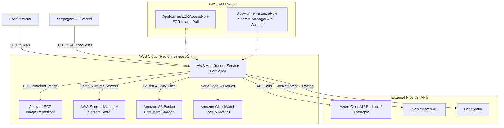

# AWS App Runner & ECR Deployment Guide for Deep Research Agent

This guide provides step-by-step instructions for deploying the Deep Research Agent to AWS App Runner using Amazon ECR, AWS Secrets Manager, and Amazon S3.

---

## 📋 Table of Contents

- [Architecture Overview](#architecture-overview)
- [Prerequisites](#prerequisites)
- [Quick Start](#quick-start)
- [Deployment Quick Reference](#deployment-quick-reference)
- [Detailed Deployment Steps](#detailed-deployment-steps)
  - [Step 1: Environment Setup](#step-1-environment-setup)
  - [Step 2: Secrets Configuration](#step-2-secrets-configuration)
  - [Step 3: Container Build and Push to ECR](#step-3-container-build-and-push-to-ecr)
  - [Step 4: IAM Roles & Permissions Setup](#step-4-iam-roles--permissions-setup)
  - [Step 5: App Runner Service Deployment](#step-5-app-runner-service-deployment)
  - [Step 6: Health Verification](#step-6-health-verification)
- [Persistent Storage & S3 Synchronization](#persistent-storage--s3-synchronization)
- [Environment Variables & Secrets Reference](#environment-variables--secrets-reference)
- [Monitoring & Observability](#monitoring--observability)
- [Scaling & Performance](#scaling--performance)
- [Security Best Practices](#security-best-practices)
- [Troubleshooting](#troubleshooting)

---

## Architecture Overview

### Deployment Architecture



### Key Components

1. **AWS App Runner Service**: Managed fully serverless container hosting for the LangGraph agent endpoint running on port 2024.
2. **Amazon ECR**: Container image registry storing the `deep-research-agent` Docker image built via `Dockerfile-aws`.
3. **AWS Secrets Manager**: Encrypted secret storage for API keys (`TAVILY-API-KEY`, `LANGCHAIN-API-KEY`, `AZURE-OPENAI-API-KEY`, `UPLOAD-API-KEY`, etc.).
4. **Amazon S3**: Persistent object storage for research inputs, documents, generated output reports, evaluation history, and SQLite state databases.
5. **IAM Roles**:
   - `AppRunnerECRAccessRole`: Grants App Runner permission to authenticate with ECR and pull container images.
   - `AppRunnerInstanceRole`: Grants runtime container permission to read secrets from Secrets Manager and read/write to the Amazon S3 bucket.

---

## Prerequisites

### Required Tools

- **AWS CLI v2**: Installed and authenticated (`aws configure` or environment credentials).
- **Container Engine**: Docker Desktop, Finch, or container runtime installed locally.
- **Python 3.10+**: For script execution and version management utilities.

```bash
# Verify AWS CLI installation and authentication
aws sts get-caller-identity

# Verify container runtime
docker --version
# or
container system status
```

### Required AWS Account Permissions

Ensure your AWS IAM user or role has administrative or targeted permissions for:
- Amazon ECR (`ecr:*`)
- AWS App Runner (`apprunner:*`)
- AWS Secrets Manager (`secretsmanager:*`)
- Amazon S3 (`s3:*`)
- AWS IAM (`iam:CreateRole`, `iam:AttachRolePolicy`, `iam:PutRolePolicy`, `iam:GetRole`)

---

## Quick Start

Execute a full deployment to AWS App Runner using the provided automation scripts:

```bash
# 1. Configure target environment variables
cp env-aws.sh env-aws.local.sh
source ./env-aws.sh

# 2. Configure secret parameters (template setup)
cp secrets-aws.sh.example secrets-aws.sh
chmod 600 secrets-aws.sh
# Edit secrets-aws.sh with your actual API keys, then populate AWS Secrets Manager:
./secrets-aws.sh

# 3. Build and push container image to Amazon ECR
./build-aws.sh

# 4. Deploy service to AWS App Runner
./deploy-aws.sh

# 5. Perform bi-directional file synchronization with S3
./sync-files-aws.sh
```

---

## Deployment Quick Reference

### Common Scenarios

| Scenario | Recommended Commands | Description |
|----------|----------------------|-------------|
| **🆕 First-Time Setup** | `./secrets-aws.sh`<br/>`./build-aws.sh`<br/>`./deploy-aws.sh` | Full initial infrastructure creation, build, secret creation, and service launch. |
| **🔄 Application Code Changes** | `./build-aws.sh`<br/>`./deploy-aws.sh --skip-infra-setup` | Builds new Docker image, pushes tag to ECR, and updates running App Runner deployment. |
| **🔑 API Key / Secret Updates** | `./secrets-aws.sh`<br/>`./deploy-aws.sh --skip-infra-setup` | Updates Secret values in AWS Secrets Manager and restarts App Runner service. |
| **📁 Sync Data / Documents** | `./sync-files-aws.sh` | Bi-directionally syncs local `./sync-aws/` directory with S3 bucket. |

### Deployment Script Options (`deploy-aws.sh`)

| Flag | Purpose | Usage |
|------|---------|-------|
| *(none)* | Full deployment including IAM and Secrets validation | Standard full update |
| `--skip-infra-setup` | Skips IAM role checking and Secrets Manager validation | Fast deployment when updating code/image only |
| `--help` / `-h` | Displays usage instructions and examples | Information reference |

---

## Detailed Deployment Steps

### Step 1: Environment Setup

The deployment behavior is governed by `env-aws.sh`. Review and configure the variables according to your AWS environment:

```bash
export SEED="0312"
export APP_NAME="deep-research-agent-$SEED"

# AWS Region Configuration
export AWS_REGION="us-east-1"
export AWS_PAGER=""

# Resource Names
export ECR_REPO_NAME="deep-research-agent-$SEED"
export APP_RUNNER_SERVICE_NAME="deep-research-agent-$SEED"
export SECRETS_MANAGER_NAME="kv-deep-agents-$SEED"
export S3_BUCKET_NAME="deep-research-files-$SEED"
```

Source the script to make these environment variables active in your current shell:

```bash
source ./env-aws.sh
```

---

### Step 2: Secrets Configuration

The Deep Research Agent reads credentials at runtime from AWS Secrets Manager using IAM role authentication.

1. **Copy Secret Template**:
   ```bash
   cp secrets-aws.sh.example secrets-aws.sh
   chmod 600 secrets-aws.sh
   ```

2. **Edit `secrets-aws.sh`** with valid values (replace placeholder values):
   ```bash
   TAVILY_API_KEY="<your-tavily-api-key>"
   LANGCHAIN_API_KEY="<your-langsmith-api-key>"
   AZURE_OPENAI_ENDPOINT="https://<your-resource>.cognitiveservices.azure.com/"
   AZURE_OPENAI_DEPLOYMENT="<your-deployment-name>"
   AZURE_OPENAI_API_KEY="<your-azure-openai-key>"
   UPLOAD_API_KEY="<your-upload-api-key>"
   LANGGRAPH_API_KEY="<your-langgraph-api-key>"
   ```

3. **Populate AWS Secrets Manager**:
   ```bash
   ./secrets-aws.sh
   ```

> [!CAUTION]
> Real secrets are **never** committed to Git. `secrets-aws.sh` is included in `.gitignore`.

---

### Step 3: Container Build and Push to ECR

The container build process relies on `Dockerfile-aws`, which optimizes dependencies for AWS environments.

Run `./build-aws.sh` to execute the following steps automatically:

```bash
# 1. Verify AWS credentials
aws sts get-caller-identity

# 2. Ensure ECR repository exists
aws ecr create-repository --repository-name "$ECR_REPO_NAME" --region "$AWS_REGION" --image-scanning-configuration scanOnPush=true

# 3. Increment internal API version in webapp/config.py
python3 ./increment_version.py

# 4. Build container image (amd64 architecture)
docker build --no-cache --platform linux/amd64 -f Dockerfile-aws -t "$ECR_URL/$ECR_REPO_NAME:latest" .

# 5. Authenticate with ECR and push image
aws ecr get-login-password --region "$AWS_REGION" | docker login --username AWS --password-stdin "$ECR_URL"
docker push "$ECR_URL/$ECR_REPO_NAME:latest"
docker push "$ECR_URL/$ECR_REPO_NAME:<timestamp-tag>"
```

---

### Step 4: IAM Roles & Permissions Setup

AWS App Runner requires two distinct IAM roles:

1. **ECR Access Role (`AppRunnerECRAccessRole-$SEED`)**:
   - **Trust Service**: `build.apprunner.amazonaws.com`
   - **Policy**: `AWSAppRunnerServicePolicyForECRAccess`
   - **Purpose**: Allows App Runner service to pull images from Amazon ECR.

2. **Instance Role (`AppRunnerInstanceRole-$SEED`)**:
   - **Trust Service**: `tasks.apprunner.amazonaws.com`
   - **Inline Secrets Manager Policy**:
     ```json
     {
       "Version": "2012-10-17",
       "Statement": [
         {
           "Effect": "Allow",
           "Action": ["secretsmanager:GetSecretValue"],
           "Resource": "arn:aws:secretsmanager:us-east-1:<account-id>:secret:kv-deep-agents-0312-*"
         }
       ]
     }
     ```
   - **Inline S3 Access Policy**:
     ```json
     {
       "Version": "2012-10-17",
       "Statement": [
         {
           "Effect": "Allow",
           "Action": [
             "s3:GetObject",
             "s3:PutObject",
             "s3:DeleteObject",
             "s3:ListBucket"
           ],
           "Resource": [
             "arn:aws:s3:::deep-research-files-0312",
             "arn:aws:s3:::deep-research-files-0312/*"
           ]
         }
       ]
     }
     ```

The `./deploy-aws.sh` script automatically constructs and applies these policies if they do not already exist.

---

### Step 5: App Runner Service Deployment

Deploy the service to AWS App Runner using `./deploy-aws.sh`:

```bash
./deploy-aws.sh
```

During execution, `deploy-aws.sh` creates or updates an App Runner service configured with:
- **CPU / Memory**: 2 vCPU / 4 GB RAM
- **Port**: 2024
- **Runtime Environment Secrets**: Secret mapping directly referencing AWS Secrets Manager JSON keys:
  - `TAVILY_API_KEY` $\rightarrow$ Secret ARN `:TAVILY-API-KEY::`
  - `LANGCHAIN_API_KEY` $\rightarrow$ Secret ARN `:LANGCHAIN-API-KEY::`
  - `UPLOAD_API_KEY` $\rightarrow$ Secret ARN `:UPLOAD-API-KEY::`
  - `AWS_BEARER_TOKEN_BEDROCK` $\rightarrow$ Secret ARN `:AWS-BEARER-TOKEN-BEDROCK::`

Once created, AWS App Runner supplies a publicly accessible HTTPS endpoint formatted as:
`https://<random-id>.<region>.awsapprunner.com`

The script automatically records this endpoint as `DEEP_RESEARCH_AGENT_URL` in `env-aws.sh`.

---

### Step 6: Health Verification

Verify deployment health using `curl`:

```bash
source ./env-aws.sh
curl -s "$DEEP_RESEARCH_AGENT_URL/health"
```

Expected JSON response:
```json
{
  "status": "healthy",
  "version": "1.0.x",
  "agent": "deep-research"
}
```

---

## Persistent Storage & S3 Synchronization

### Amazon S3 Storage Architecture

The application requires persistence across container deployments for:
- Input documents (`docs/`, `input/`)
- Generated output reports (`output/`, `output/eval_history/`)
- Agent state databases (`deep_research.db`, `.langgraph_api/`)

The Python runtime integrates directly with S3 using `s3_storage.py`. Additionally, developer tools can perform bi-directional local sync using `./sync-files-aws.sh`.

```
s3://deep-research-files-0312/
├── docs/                 # Document context files
│   └── policy/           # Internal reference documents
├── output/               # Generated research reports & evaluation outputs
│   └── eval_history/     # JSONL server run tracking
├── input/                # User input payloads
└── .langgraph_api/       # Checkpoints and state tracking
```

### Synchronization Commands

```bash
# Bi-directional sync (Downloads missing remote files, uploads missing local files)
./sync-files-aws.sh

# Download mode (Only fetch remote files from S3 to ./sync-aws/)
./sync-files-aws.sh --download

# Upload mode (Only upload local ./sync-aws/ files to S3)
./sync-files-aws.sh --upload

# Verbose output mode
./sync-files-aws.sh --verbose
```

---

## Environment Variables & Secrets Reference

### Environment Variables

| Variable Name | Default / Example | Purpose |
|---------------|-------------------|---------|
| `PORT` | `2024` | Primary web server listening port |
| `VERIFY_SSL` | `false` | SSL verification behavior for internal fetchers |
| `LOG_LEVEL` | `INFO` | Logging detail level |
| `LANGCHAIN_TRACING_V2` | `true` | Enables LangSmith telemetry tracing |
| `LANGSMITH_ENDPOINT` | `https://api.smith.langchain.com` | LangSmith telemetry collector URL |
| `LANGCHAIN_PROJECT` | `deep-research-production` | Target LangSmith project name |
| `ENABLE_EVAL_TRACKING` | `true` | Enables baseline metrics logging |
| `MODEL_TPM` | `120000` | Tokens per minute quota limit |
| `MODEL_RPM` | `500` | Requests per minute quota limit |
| `GRAPH_RECURSION_LIMIT` | `200` | Max recursion depth in LangGraph workflow |
| `MAX_CONCURRENT_RESEARCH_UNITS` | `3` | Parallel sub-agent concurrency cap |
| `S3_BUCKET_NAME` | `deep-research-files-0312` | Target Amazon S3 bucket name |
| `AWS_REGION` | `us-east-1` | Target AWS deployment region |

### Runtime Secrets (AWS Secrets Manager)

| Secret Key | Source Secret ARN Target | Description |
|------------|---------------------------|-------------|
| `TAVILY_API_KEY` | `${SECRET_ARN}:TAVILY-API-KEY::` | Tavily Search engine key |
| `LANGCHAIN_API_KEY` | `${SECRET_ARN}:LANGCHAIN-API-KEY::` | LangSmith API authentication token |
| `UPLOAD_API_KEY` | `${SECRET_ARN}:UPLOAD-API-KEY::` | Secure document upload endpoint key |
| `AWS_BEARER_TOKEN_BEDROCK` | `${SECRET_ARN}:AWS-BEARER-TOKEN-BEDROCK::` | Optional AWS Bedrock access token |
| `AWS_BEDROCK_ENDPOINT` | `${SECRET_ARN}:AWS-BEDROCK-ENDPOINT::` | Optional AWS Bedrock endpoint URL |
| `MODEL_NAME` | `${SECRET_ARN}:MODEL-NAME::` | LLM model selection string |

---

## Monitoring & Observability

### CloudWatch Logs

AWS App Runner streams application STDOUT and STDERR output to Amazon CloudWatch Logs automatically.

1. Open **AWS Management Console** $\rightarrow$ **App Runner**.
2. Select your service (`deep-research-agent-0312`).
3. Click the **Logs** tab to view:
   - **System Logs**: Container provisioning and HTTP ingress status.
   - **Application Logs**: Python application stdout log output.

### Metrics Monitoring

Monitor container operational performance in the App Runner Console:
- **CPU Utilization**: CPU percent usage.
- **Memory Utilization**: RAM consumption (4 GB allocation).
- **Request Count**: Total incoming HTTP requests per minute.
- **HTTP Response Time**: Latency breakdown.

---

## Scaling & Performance

AWS App Runner provides automatic horizontal scaling based on request concurrency:

- **Default Instance Capacity**: 2 vCPU, 4 GB RAM per instance.
- **Min Replicas**: 1 (preserves warm instance).
- **Max Replicas**: 5.
- **Max Concurrency per Instance**: 100 requests.

When concurrent active requests exceed 100, App Runner automatically provisions additional container instances.

---

## Security Best Practices

1. **Least Privilege IAM**:
   - Limit `AppRunnerInstanceRole` S3 permissions strictly to `arn:aws:s3:::<your-bucket-name>` and `arn:aws:s3:::<your-bucket-name>/*`.
   - Limit Secrets Manager read access strictly to the secret ARN used by the application.

2. **Secret Encryption**:
   - API keys are stored in AWS Secrets Manager using KMS encryption.
   - Values are injected securely into memory at runtime; secrets are **never** logged to disk or console.

3. **HTTPS Encryption**:
   - All inbound communication to App Runner uses TLS 1.2+ HTTPS automatically provided by AWS managed certificates.

---

## Troubleshooting

### Common Issues and Resolutions

#### 1. Image build fails on `container push` or `docker push`
- **Cause**: ECR authentication token expired or missing ECR repository.
- **Fix**: Re-authenticate with ECR and verify repository:
  ```bash
  aws ecr get-login-password --region us-east-1 | docker login --username AWS --password-stdin <aws-account-id>.dkr.ecr.us-east-1.amazonaws.com
  ```

#### 2. App Runner service deployment fails (`CREATE_FAILED`)
- **Cause**: Invalid IAM role permissions or missing secrets in AWS Secrets Manager.
- **Fix**: Run `./secrets-aws.sh` to ensure the secret exists in Secrets Manager, then check the App Runner event log in the AWS Console.

#### 3. Health check fails or returns 500 error
- **Cause**: Missing mandatory API key (e.g., `TAVILY_API_KEY`) or failure connecting to LLM provider.
- **Fix**: Inspect CloudWatch Logs under the App Runner service page:
  ```bash
  aws apprunner describe-service --service-arn <service-arn> --region us-east-1
  ```

#### 4. S3 Synchronization errors
- **Cause**: Instance Role or local credentials lack `s3:GetObject` / `s3:PutObject` access.
- **Fix**: Verify bucket accessibility using AWS CLI:
  ```bash
  aws s3 ls "s3://$S3_BUCKET_NAME/"
  ```
