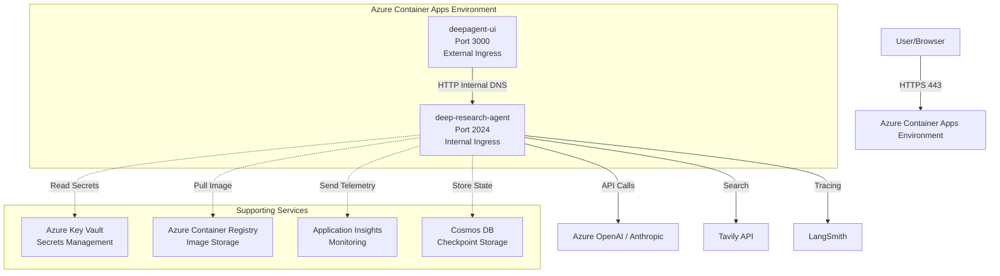
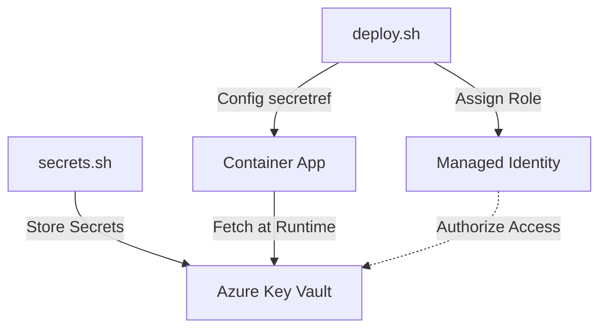
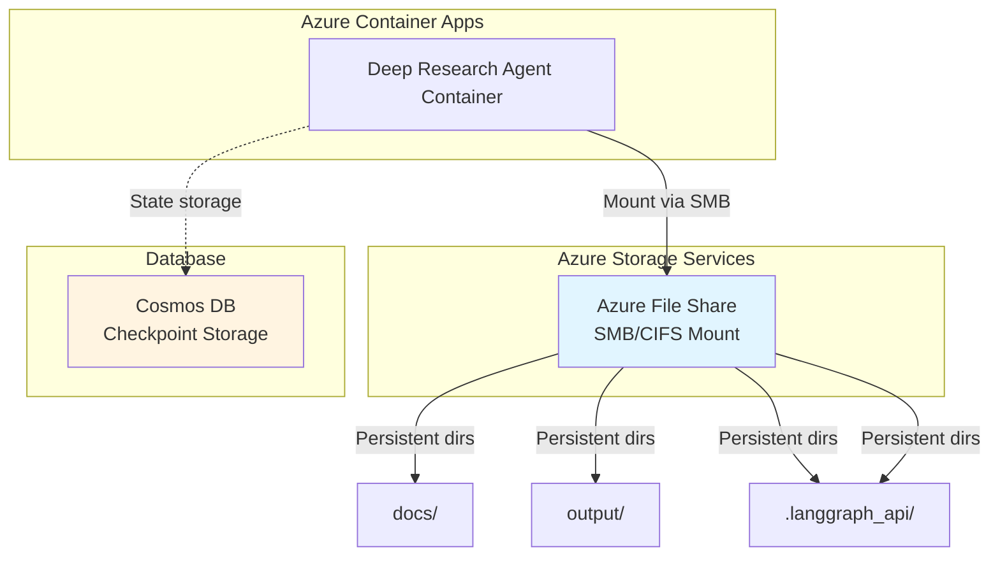

# Azure Container Apps Deployment Guide for Deep Research Agent

This guide provides step-by-step instructions for deploying the Deep Research Agent to Azure Container Apps and configuring container-to-container communication with the deepagent-ui.

## 📋 Table of Contents

- [Architecture Overview](#architecture-overview)
- [Prerequisites](#prerequisites)
- [Quick Start](#quick-start)
- [Deployment Quick Reference](#-deployment-quick-reference)
- [Detailed Deployment Steps](#detailed-deployment-steps)
- [Key Vault Integration Details](#-key-vault-integration-details)
- [Persistent Storage with Azure Files](#persistent-storage-with-azure-files)
- [Container-to-Container Communication](#container-to-container-communication)
- [Configuration Management](#configuration-management)
- [Monitoring & Observability](#monitoring--observability)
- [Scaling & Performance](#scaling--performance)
- [Security Best Practices](#security-best-practices)
- [Troubleshooting](#troubleshooting)
- [Cost Optimization](#cost-optimization)

---

## Architecture Overview

### Deployment Architecture



### Key Components

1. **deep-research-agent**: LangGraph server running on port 2024 (internal only)
2. **deepagent-ui**: React/Next.js frontend on port 3000 (external access)
3. **Azure Container Apps Environment**: Managed Kubernetes-like environment
4. **Internal DNS**: Enables secure container-to-container communication
5. **Azure Key Vault**: Secure secret management
6. **Application Insights**: Monitoring and telemetry

---

## Prerequisites

### Required Tools

```bash
# Install Azure CLI
curl -sL https://aka.ms/InstallAzureCLIDeb | sudo bash

# Install Docker
# macOS: Download from https://docs.docker.com/desktop/install/mac-install/
# Linux: curl -fsSL https://get.docker.com | sh
# Windows with npm: npm install -g docker

# Verify installations
az --version
docker --version
```

[Troubleshooting Azure CLI | Microsoft Learn](https://learn.microsoft.com/en-us/cli/azure/use-azure-cli-successfully-troubleshooting?view=azure-cli-latest#work-behind-a-proxy)
[Azure CLI Setup - Branch Technology Modernization](https://bmo.atlassian.net/wiki/spaces/PR034742/pages/595441403/Azure+CLI+setup)

### Azure Subscription Requirements

- Active Azure subscription with permissions to create:
  - Resource Groups
  - Container Apps Environments
  - Container Registries
  - Key Vaults
  - Application Insights
  - (Optional) Cosmos DB accounts

### Local Configuration

```bash
# Login to Azure
$env:REQUESTS_CA_BUNDLE="C:\path\to\your\cert.pem"
az login --use-device-code

# Set your subscription
az account set --subscription 9d831a41-d092-4625-8861-89341d476f2d

# Create resource group
export RESOURCE_GROUP="rg-deep-agents"
export LOCATION="canadacentral"

az group create \
  --name $RESOURCE_GROUP \
  --location $LOCATION
```

---

## Quick Start

For a rapid deployment, use these commands:

```bash
cd deepagents-demo/deep_research

# 1. Build and push Docker image
export ACR_NAME="acrdeepagents"
az acr create --resource-group $RESOURCE_GROUP --name $ACR_NAME --sku Basic --admin-enabled true
az acr login -n $ACR_NAME --expose-token
az acr login --name $ACR_NAME

docker build --platform linux/amd64 -t $ACR_NAME.azurecr.io/deep-research-agent:latest .
docker push $ACR_NAME.azurecr.io/deep-research-agent:latest

# 2. Create Container Apps environment
export ENV_NAME="env-deep-agents"
az containerapp env create \
  --name $ENV_NAME \
  --resource-group $RESOURCE_GROUP \
  --location $LOCATION

# 3. Deploy agent
export AGENT_NAME="deep-research-agent"
export ACR_USERNAME=$(az acr credential show --name $ACR_NAME --query username -o tsv)
export ACR_PASSWORD=$(az acr credential show --name $ACR_NAME --query 'passwords[0].value' -o tsv)

az containerapp create \
  --name $AGENT_NAME \
  --resource-group $RESOURCE_GROUP \
  --environment $ENV_NAME \
  --image $ACR_NAME.azurecr.io/deep-research-agent:latest \
  --registry-server $ACR_NAME.azurecr.io \
  --registry-username $ACR_USERNAME \
  --registry-password $ACR_PASSWORD \
  --target-port 2024 \
  --ingress internal \
  --min-replicas 1 \
  --max-replicas 3 \
  --cpu 2.0 \
  --memory 4Gi \
  --env-vars \
    ANTHROPIC_API_KEY=<your-key> \
    TAVILY_API_KEY=<your-key> \
    LANGCHAIN_TRACING_V2=true \
    LANGSMITH_ENDPOINT=https://api.smith.langchain.com \
    LANGCHAIN_API_KEY=<your-key> \
    LANGCHAIN_PROJECT=deep-research-production \
    ENABLE_EVAL_TRACKING=true \
    EVAL_HISTORY_FILE=./output/eval_history/server_runs.jsonl \
    MODEL_TPM=120000 \
    MODEL_RPM=500 \
    GRAPH_RECURSION_LIMIT=200 \
    MAX_CONCURRENT_RESEARCH_UNITS=3 \
    MAX_RESEARCHER_ITERATIONS=3

# 4. Get internal URL
INTERNAL_URL=$(az containerapp show \
  --name $AGENT_NAME \
  --resource-group $RESOURCE_GROUP \
  --query properties.configuration.ingress.fqdn \
  -o tsv)

echo "Agent Internal URL: https://$INTERNAL_URL"
echo "Test: curl https://$INTERNAL_URL/research/invoke"
```

---

## ⚡ Deployment Quick Reference

### Common Scenarios

| Scenario | Commands |
|----------|----------|
| **🆕 First-Time** | `./secrets.sh` <br/> `./deploy.sh` |
| **🔄 Code Changes** | `./deploy.sh` |
| **🔑 Secrets Update** | `./secrets.sh` <br/> `./deploy.sh --skip-build` |
| **⚡ Config Update** | `./deploy.sh --skip-build` |
| **📁 Sync Files** | `./deploy.sh --sync-files` |

### Command Options Reference

| Flag | Description | Use Case |
|------|-------------|----------|
| *(none)* | Full build + deploy | Code changes, new features |
| `--skip-build` | Skip Docker build | Config/secrets/RBAC updates only (saves ~2-5 mins) |
| `--sync-files` | Sync local files to Azure | Initial setup or manual data update |

**When to use `--skip-build`:**
- ✅ Use for: Key Vault updates, Env var changes, RBAC tweaks.
- ❌ Don't use for: Python code changes, `pyproject.toml` updates, `Dockerfile` changes.

---

## Detailed Deployment Steps

### Step 1: Prepare Docker Image

#### Review Existing Dockerfile

The project includes a production-ready `Dockerfile` based on `langchain/langgraph-api:3.11`:

```dockerfile
FROM python:3.12-slim

# Install system dependencies
RUN apt-get update && apt-get install -y --no-install-recommends \
    curl \
    git \
    && rm -rf /var/lib/apt/lists/*

# Install a specific, stable version of uv
RUN curl -LsSf https://astral.sh/uv/0.5.0/install.sh | env UV_UNMANAGED_INSTALL="/usr/local/bin" sh

# Set up working directory
WORKDIR /deps/deep_research

# Copy the local package
ADD .. /deps/deep_research

# Use pip directly instead of uv sync to avoid segfault
RUN pip install --no-cache-dir -e .

# Set the host for the dev server
ENV HOST=0.0.0.0
ENV PORT=2024

EXPOSE 2024

# Launch using langgraph dev
CMD ["langgraph", "dev", "--host", "0.0.0.0", "--port", "2024"]
```

#### Build and Push to Azure Container Registry

```bash
# Create Container Registry
export ACR_NAME="acrdeepagents" # $(openssl rand -hex 4)
az acr create \
  --resource-group $RESOURCE_GROUP \
  --name $ACR_NAME \
  --sku Standard \
  --admin-enabled true
  
# List all ACRs in your resource group
az acr list \
  --resource-group $RESOURCE_GROUP \
  --query "[].name" -o tsv
  
# Or get a specific ACR by filtering
az acr list \
  --resource-group $RESOURCE_GROUP \
  --query "[?contains(name, 'acrdeepagents')].name" -o tsv

source ./env.sh
# Login to ACR
az acr login --name $ACR_NAME

# Build image (from deep_research directory)
cd deepagents-demo/deep_research
docker build --platform linux/amd64 -t $ACR_NAME.azurecr.io/deep-research-agent:latest .

# Push image
docker push $ACR_NAME.azurecr.io/deep-research-agent:latest

# Verify image
az acr repository list --name $ACR_NAME --output table
az acr repository show-tags --name $ACR_NAME --repository deep-research-agent --output table
```

### Step 2: Create Container Apps Environment

```bash
# Create environment with workload profiles (recommended for production)
export ENV_NAME="env-deep-agents"
az containerapp env create \
  --name $ENV_NAME \
  --resource-group $RESOURCE_GROUP \
  --location $LOCATION \
  --logs-workspace-id $(az monitor log-analytics workspace create \
    --resource-group $RESOURCE_GROUP \
    --workspace-name la-deep-agents \
    --query customerId -o tsv \
    --only-show-errors) \
  --logs-workspace-key $(az monitor log-analytics workspace get-shared-keys \
    --resource-group $RESOURCE_GROUP \
    --workspace-name la-deep-agents \
    --query primarySharedKey -o tsv)

# Enable Application Insights integration
az monitor app-insights component create \
  --app ai-deep-agents \
  --location $LOCATION \
  --resource-group $RESOURCE_GROUP \
  --kind web

az containerapp env telemetry application-insights set \
  --name $ENV_NAME \
  --resource-group $RESOURCE_GROUP \
  --instrumentation-key $(az monitor app-insights component show \
    --app ai-deep-agents \
    --resource-group $RESOURCE_GROUP \
    --query instrumentationKey -o tsv)
    
```

### Step 3: Configure Secrets in Azure Key Vault

This project uses Azure Key Vault for secure secret management. Real secrets are **never** stored in version control.

#### Setup Instructions

**Option 1: Using `secrets.sh` (Recommended)**
1. **Copy the template:** `cp secrets.sh.example secrets.sh`
2. **Edit `secrets.sh`** with your actual values (Tavily, LangChain, Azure OpenAI).
3. **Populate Key Vault:** `./secrets.sh`
4. **Secure the file:** `chmod 600 secrets.sh` or delete it.

**Option 2: Using Environment Variables**
Set variables before running `deploy.sh`:
```bash
export TAVILY_API_KEY="tvly-..."
export AZURE_OPENAI_API_KEY="..."
./deploy.sh
```
The script will detect these and update Key Vault automatically.

#### Required API Keys
- **Tavily**: [app.tavily.com](https://app.tavily.com)
- **LangSmith**: [smith.langchain.com](https://smith.langchain.com/settings)
- **Azure OpenAI**: Keys and Endpoint from Azure Portal resource.

#### Security Best Practices
- ✅ Use `secrets.sh.example` as a template.
- ✅ Store real secrets in Key Vault.
- ❌ **NEVER** commit `secrets.sh` or `.env` files.
- ❌ **NEVER** hardcode secrets in source code.

---

## 🔐 Key Vault Integration Details

### Architecture Flow



### How It Works
The fix implements **Azure Key Vault secret references** in Container Apps using managed identity:
1. **Managed Identity**: A system-assigned managed identity is created for the app.
2. **RBAC Authorization**: The identity is granted the "Key Vault Secrets User" role (least privilege).
3. **Secret References**: Secrets are defined in the App config pointing to Key Vault URLs. 
4. **Runtime Injection**: Azure injects the values as environment variables (e.g., `TAVILY_API_KEY=secretref:tavily-api-key`) at runtime.

### Verification
```bash
# List secrets in Key Vault
az keyvault secret list --vault-name $KV_NAME -o table

# Verify managed identity permissions
az role assignment list --assignee $PRINCIPAL_ID --scope $KV_ID
```

### Step 4: Deploy Deep Research Agent

```bash
export AGENT_NAME="deep-research-agent"

# Option 1: Using System-Assigned Identity (Follow this if you used Option 1 in Step 3)
az containerapp create \
  --name $AGENT_NAME \
  --resource-group $RESOURCE_GROUP \
  --environment $ENV_NAME \
  --image $ACR_NAME.azurecr.io/deep-research-agent:latest \
  --registry-server $ACR_NAME.azurecr.io \
  --registry-username $ACR_USERNAME \
  --registry-password $ACR_PASSWORD \
  --target-port 2024 \
  --ingress internal \
  --transport auto \
  --min-replicas 1 \
  --max-replicas 5 \
  --cpu 2.0 \
  --memory 4Gi \
  --env-vars \
    VERIFY_SSL=false \
    LOG_LEVEL=INFO \
    LANGCHAIN_TRACING_V2=true \
    LANGSMITH_ENDPOINT=https://api.smith.langchain.com \
    LANGCHAIN_PROJECT=deep-research-production \
    ENABLE_EVAL_TRACKING=true \
    EVAL_HISTORY_FILE=./output/eval_history/server_runs.jsonl \
    MODEL_TPM=120000 \
    MODEL_RPM=500 \
    GRAPH_RECURSION_LIMIT=200 \
    MAX_CONCURRENT_RESEARCH_UNITS=3 \
    MAX_RESEARCHER_ITERATIONS=3 \
    MAX_GLOB_DEPTH=3 \
    REPORTS_OUTPUT_FOLDER=./output \
    MAX_FILES_TO_READ=20 \
    MAX_TOTAL_SIZE_MB=50 \
    MODEL_MAX_RETRIES=5 \
    MODEL_INITIAL_BACKOFF=1.0 \
    MODEL_MAX_BACKOFF=60.0 \
    MODEL_BACKOFF_MULTIPLIER=2.0 \
    MODEL_RETRY_JITTER=true \
    AZURE_OPENAI_API_VERSION=2025-04-01-preview \
    TAVILY_API_KEY=secretref:tavily-api-key \
    LANGCHAIN_API_KEY=secretref:langchain-api-key \
    AZURE_OPENAI_ENDPOINT=secretref:azure-openai-endpoint \
    AZURE_OPENAI_DEPLOYMENT=secretref:azure-openai-deployment \
    AZURE_OPENAI_API_KEY=secretref:azure-openai-api-key \
    UPLOAD_API_KEY=secretref:upload-api-key \
  --secrets \
    tavily-api-key=keyvaultref:https://$KV_NAME.vault.azure.net/secrets/TAVILY-API-KEY,identityref:system \
    langchain-api-key=keyvaultref:https://$KV_NAME.vault.azure.net/secrets/LANGCHAIN-API-KEY,identityref:system \
    azure-openai-endpoint=keyvaultref:https://$KV_NAME.vault.azure.net/secrets/AZURE-OPENAI-ENDPOINT,identityref:system \
    azure-openai-deployment=keyvaultref:https://$KV_NAME.vault.azure.net/secrets/AZURE-OPENAI-DEPLOYMENT,identityref:system \
    azure-openai-api-key=keyvaultref:https://$KV_NAME.vault.azure.net/secrets/AZURE-OPENAI-API-KEY,identityref:system \
    upload-api-key=keyvaultref:https://$KV_NAME.vault.azure.net/secrets/UPLOAD-API-KEY,identityref:system \
  --system-assigned

az containerapp update \
  --name $AGENT_NAME \
  --resource-group $RESOURCE_GROUP \
  --set-env-vars \
    AZURE_OPENAI_API_VERSION="2025-04-01-preview"
    
# Update secrets and environment variable references
az containerapp update \
  --name $AGENT_NAME \
  --resource-group $RESOURCE_GROUP \
  --set "properties.configuration.secrets=[
    {
      \"name\": \"tavily-api-key\",
      \"keyVaultUrl\": \"https://$KV_NAME.vault.azure.net/secrets/TAVILY-API-KEY\",
      \"identity\": \"system\"
    },
    {
      \"name\": \"langchain-api-key\",
      \"keyVaultUrl\": \"https://$KV_NAME.vault.azure.net/secrets/LANGCHAIN-API-KEY\",
      \"identity\": \"system\"
    },
    {
      \"name\": \"azure-openai-endpoint\",
      \"keyVaultUrl\": \"https://$KV_NAME.vault.azure.net/secrets/AZURE-OPENAI-ENDPOINT\",
      \"identity\": \"system\"
    },
    {
      \"name\": \"azure-openai-deployment\",
      \"keyVaultUrl\": \"https://$KV_NAME.vault.azure.net/secrets/AZURE-OPENAI-DEPLOYMENT\",
      \"identity\": \"system\"
    },
    {
      \"name\": \"azure-openai-api-key\",
      \"keyVaultUrl\": \"https://$KV_NAME.vault.azure.net/secrets/AZURE-OPENAI-API-KEY\",
      \"identity\": \"system\"
    },
    {
      \"name\": \"upload-api-key\",
      \"keyVaultUrl\": \"https://$KV_NAME.vault.azure.net/secrets/UPLOAD-API-KEY\",
      \"identity\": \"system\"
    }
  ]"


# Update Container App to use SQLite instead of PostgreSQL
az containerapp update \
  --name $AGENT_NAME \
  --resource-group $RESOURCE_GROUP \
  --set-env-vars \
    DATABASE_URI="sqlite:///./langgraph.db" \
    REDIS_URI="" \
    REDIS_URI_CUSTOM=""

# Restart that specific revision
az containerapp update \
  --name $AGENT_NAME \
  --resource-group $RESOURCE_GROUP \
  --set-env-vars RESTART_TRIGGER="$(date +%s)"
  
az containerapp logs show \
  --name $AGENT_NAME \
  --resource-group $RESOURCE_GROUP \
  --tail 50
```

### Step 5: Verify Deployment

```bash
# Get agent details
az containerapp show \
  --name $AGENT_NAME \
  --resource-group $RESOURCE_GROUP \
  --query "{Name: name, FQDN: properties.configuration.ingress.fqdn, Status: properties.provisioningState}"

# Test connectivity (from within Azure network or using kubectl exec)
INTERNAL_FQDN=$(az containerapp show \
  --name $AGENT_NAME \
  --resource-group $RESOURCE_GROUP \
  --query properties.configuration.ingress.fqdn \
  -o tsv)

# Execute test command inside container
az containerapp exec \
  --name $AGENT_NAME \
  --resource-group $RESOURCE_GROUP \
  --command "curl -s http://localhost:2024/docs | head -20"

# Check logs
az containerapp logs show \
  --name $AGENT_NAME \
  --resource-group $RESOURCE_GROUP \
  --follow
  
# Update the agent to use external ingress
az containerapp update \
  --name $AGENT_NAME \
  --resource-group $RESOURCE_GROUP \
  --set properties.configuration.ingress.external=true \
          properties.configuration.ingress.targetPort=2024 \
          properties.configuration.ingress.transport="auto"

# Get the external FQDN
EXTERNAL_URL=$(az containerapp show \
  --name $AGENT_NAME \
  --resource-group $RESOURCE_GROUP \
  --query properties.configuration.ingress.fqdn \
  -o tsv)

echo "External URL: https://$EXTERNAL_URL"

# Test health endpoint
curl -s "https://$EXTERNAL_URL/health" | head -10
```

---

## Persistent Storage with Azure Files

### Problem Statement

By default, Azure Container Apps containers are ephemeral - any files written to the container's filesystem are lost when the container restarts or is redeployed. The Deep Research Agent needs to persist:

- **`docs/`** - Document storage (policy docs, research materials)
- **`output/`** - Generated reports, evaluation history JSONL files
- **`input/`** - Input files for processing
- **`.langgraph_api/`** - LangGraph checkpoint/state data (if using SQLite)

### Solution: Azure Files Volume Mount

Azure Files provides SMB/CIFS network file shares that can be mounted into Container Apps, providing persistent storage that survives container restarts and redeployments.

### Architecture



### Step 1: Update Dockerfile

The Dockerfile no longer needs to create runtime directories since they will be provided by the volume mount:

```dockerfile
FROM python:3.12-slim

# Install system dependencies including cifs-utils for SMB support
RUN apt-get update && apt-get install -y --no-install-recommends \
    curl \
    git \
    cifs-utils \
    && rm -rf /var/lib/apt/lists/*

# Install a specific, stable version of uv
RUN curl -LsSf https://astral.sh/uv/0.5.0/install.sh | env UV_UNMANAGED_INSTALL="/usr/local/bin" sh

# Set up working directory
WORKDIR /deps/deep_research

# Copy the local package
ADD . /deps/deep_research
RUN cp /deps/deep_research/.env.docker /deps/deep_research/.env

# Note: Runtime directories (docs/, output/, input/) are mounted via Azure Files at runtime
# No need to create them in the Docker image - they will be provided by the volume mount

# Use pip directly instead of uv sync to avoid segfault
RUN pip install --no-cache-dir -e .

# Set the host for the dev server
ENV HOST=0.0.0.0
ENV PORT=2024

EXPOSE 2024

# Launch using langgraph dev
CMD ["langgraph", "dev", "--host", "0.0.0.0", "--port", "2024"]
```

**Key Changes:**
- Added `cifs-utils` package for SMB/CIFS mounting support
- Removed `RUN mkdir docs | mkdir docs/policy | mkdir output | mkdir input` line
- Added comment explaining runtime directory mounting

### Step 2: Create Azure Storage Account and File Share

```bash
# Set variables
export RESOURCE_GROUP="rg-deep-agents"
export LOCATION="canadacentral"
export STORAGE_ACCOUNT_NAME="stdeepagents$(openssl rand -hex 4)"
export FILE_SHARE_NAME="deep-research-files"

# Create Storage Account
az storage account create \
  --name $STORAGE_ACCOUNT_NAME \
  --resource-group $RESOURCE_GROUP \
  --location $LOCATION \
  --sku Standard_LRS \
  --kind StorageV2 \
  --allow-blob-public-access false

# Get storage account key
export STORAGE_KEY=$(az storage account keys list \
  --account-name $STORAGE_ACCOUNT_NAME \
  --resource-group $RESOURCE_GROUP \
  --query '[0].value' -o tsv)

# Create File Share with 100GB quota
az storage share create \
  --name $FILE_SHARE_NAME \
  --account-name $STORAGE_ACCOUNT_NAME \
  --account-key $STORAGE_KEY \
  --quota 100

echo "Storage Account: $STORAGE_ACCOUNT_NAME"
echo "File Share: $FILE_SHARE_NAME"
```

### Step 3: Create Directory Structure in File Share

```bash
# Create directory structure in Azure File Share
az storage directory create \
  --share-name $FILE_SHARE_NAME \
  --name "docs" \
  --account-name $STORAGE_ACCOUNT_NAME \
  --account-key $STORAGE_KEY

az storage directory create \
  --share-name $FILE_SHARE_NAME \
  --name "docs/policy" \
  --account-name $STORAGE_ACCOUNT_NAME \
  --account-key $STORAGE_KEY

az storage directory create \
  --share-name $FILE_SHARE_NAME \
  --name "output" \
  --account-name $STORAGE_ACCOUNT_NAME \
  --account-key $STORAGE_KEY

az storage directory create \
  --share-name $FILE_SHARE_NAME \
  --name "output/eval_history" \
  --account-name $STORAGE_ACCOUNT_NAME \
  --account-key $STORAGE_KEY

az storage directory create \
  --share-name $FILE_SHARE_NAME \
  --name "input" \
  --account-name $STORAGE_ACCOUNT_NAME \
  --account-key $STORAGE_KEY

# Verify structure
az storage directory list \
  --share-name $FILE_SHARE_NAME \
  --account-name $STORAGE_ACCOUNT_NAME \
  --account-key $STORAGE_KEY \
  --output table
```

### Step 4: Store Credentials in Key Vault (Recommended)

For production deployments, store storage credentials in Azure Key Vault:

```bash
export KV_NAME="kv-deep-agents"

# Store storage credentials
az keyvault secret set \
  --vault-name $KV_NAME \
  --name STORAGE-ACCOUNT-NAME \
  --value $STORAGE_ACCOUNT_NAME

az keyvault secret set \
  --vault-name $KV_NAME \
  --name STORAGE-ACCOUNT-KEY \
  --value $STORAGE_KEY

az keyvault secret set \
  --vault-name $KV_NAME \
  --name FILE-SHARE-NAME \
  --value $FILE_SHARE_NAME
```

### Step 5: Deploy Container App with Volume Mount

#### Option A: Direct Storage Credentials (Simpler)

```bash
export AGENT_NAME="deep-research-agent"
export ENV_NAME="env-deep-agents"
export ACR_NAME="acrdeepagents"

ACR_USERNAME=$(az acr credential show --name $ACR_NAME --query username -o tsv)
ACR_PASSWORD=$(az acr credential show --name $ACR_NAME --query 'passwords[0].value' -o tsv)

# Deploy with volume mount
az containerapp create \
  --name $AGENT_NAME \
  --resource-group $RESOURCE_GROUP \
  --environment $ENV_NAME \
  --image $ACR_NAME.azurecr.io/deep-research-agent:latest \
  --registry-server $ACR_NAME.azurecr.io \
  --registry-username $ACR_USERNAME \
  --registry-password $ACR_PASSWORD \
  --target-port 2024 \
  --ingress internal \
  --transport auto \
  --min-replicas 1 \
  --max-replicas 5 \
  --cpu 2.0 \
  --memory 4Gi \
  --volume persistent-storage \
  --storage-type AzureFile \
  --storage-account-name $STORAGE_ACCOUNT_NAME \
  --storage-account-key $STORAGE_KEY \
  --share-name $FILE_SHARE_NAME \
  --mount-path /deps/deep_research/mnt \
  --env-vars \
    VERIFY_SSL=false \
    LOG_LEVEL=INFO \
    LANGCHAIN_TRACING_V2=true \
    LANGSMITH_ENDPOINT=https://api.smith.langchain.com \
    LANGCHAIN_PROJECT=deep-research-production \
    ENABLE_EVAL_TRACKING=true \
    EVAL_HISTORY_FILE=/deps/deep_research/mnt/output/eval_history/server_runs.jsonl \
    MODEL_TPM=120000 \
    MODEL_RPM=500 \
    GRAPH_RECURSION_LIMIT=200 \
    MAX_CONCURRENT_RESEARCH_UNITS=3 \
    MAX_RESEARCHER_ITERATIONS=3 \
    MAX_GLOB_DEPTH=3 \
    REPORTS_OUTPUT_FOLDER=/deps/deep_research/mnt/output \
    MAX_FILES_TO_READ=20 \
    MAX_TOTAL_SIZE_MB=50 \
    DOC_FOLDER=/deps/deep_research/mnt/docs \
    INPUT_FOLDER=/deps/deep_research/mnt/input \
    MEMORY_TYPE=cosmosdb \
    COSMOSDB_DB_NAME=deep-research-checkpoints \
    COSMOSDB_CONTAINER_NAME=checkpoints
```

#### Option B: Key Vault Secret References (More Secure)

```bash
# Deploy with secret references
az containerapp create \
  --name $AGENT_NAME \
  --resource-group $RESOURCE_GROUP \
  --environment $ENV_NAME \
  --image $ACR_NAME.azurecr.io/deep-research-agent:latest \
  --registry-server $ACR_NAME.azurecr.io \
  --registry-username $ACR_USERNAME \
  --registry-password $ACR_PASSWORD \
  --target-port 2024 \
  --ingress internal \
  --transport auto \
  --min-replicas 1 \
  --max-replicas 5 \
  --cpu 2.0 \
  --memory 4Gi \
  --set "properties.template.volumes=[{
    \"name\": \"persistent-storage\",
    \"storageType\": \"AzureFile\",
    \"storageName\": \"azure-file-storage\",
    \"mountPath\": \"/deps/deep_research/mnt\"
  }]" \
  --set "properties.configuration.secrets=[
    {
      \"name\": \"storage-account-name\",
      \"keyVaultUrl\": \"https://$KV_NAME.vault.azure.net/secrets/STORAGE-ACCOUNT-NAME\",
      \"identity\": \"system\"
    },
    {
      \"name\": \"storage-account-key\",
      \"keyVaultUrl\": \"https://$KV_NAME.vault.azure.net/secrets/STORAGE-ACCOUNT-KEY\",
      \"identity\": \"system\"
    },
    {
      \"name\": \"file-share-name\",
      \"keyVaultUrl\": \"https://$KV_NAME.vault.azure.net/secrets/FILE-SHARE-NAME\",
      \"identity\": \"system\"
    }
  ]" \
  --set "properties.template.storages=[{
    \"name\": \"azure-file-storage\",
    \"azureFile\": {
      \"accountName\": \"secretref:storage-account-name\",
      \"accountKey\": \"secretref:storage-account-key\",
      \"shareName\": \"secretref:file-share-name\"
    }
  }]" \
  --env-vars \
    REPORTS_OUTPUT_FOLDER=/deps/deep_research/mnt/output \
    EVAL_HISTORY_FILE=/deps/deep_research/mnt/output/eval_history/server_runs.jsonl \
    DOC_FOLDER=/deps/deep_research/mnt/docs \
    INPUT_FOLDER=/deps/deep_research/mnt/input \
    MEMORY_TYPE=cosmosdb \
    COSMOSDB_DB_NAME=deep-research-checkpoints \
    COSMOSDB_CONTAINER_NAME=checkpoints \
  --system-assigned
```

### Step 6: Update Existing Deployment

If you already have a deployed Container App, update it to add persistent storage:

```bash
# Add volume mount
az containerapp update \
  --name $AGENT_NAME \
  --resource-group $RESOURCE_GROUP \
  --volume persistent-storage \
  --storage-type AzureFile \
  --storage-account-name $STORAGE_ACCOUNT_NAME \
  --storage-account-key $STORAGE_KEY \
  --share-name $FILE_SHARE_NAME \
  --mount-path /deps/deep_research/mnt

# Update environment variables to use mounted paths
az containerapp update \
  --name $AGENT_NAME \
  --resource-group $RESOURCE_GROUP \
  --set-env-vars \
    REPORTS_OUTPUT_FOLDER=/deps/deep_research/mnt/output \
    EVAL_HISTORY_FILE=/deps/deep_research/mnt/output/eval_history/server_runs.jsonl \
    DOC_FOLDER=/deps/deep_research/mnt/docs \
    INPUT_FOLDER=/deps/deep_research/mnt/input \
    RESTART_TRIGGER="$(date +%s)"
```

### Step 7: Verify Persistent Storage

```bash
# Exec into container to verify mounts
az containerapp exec \
  --name $AGENT_NAME \
  --resource-group $RESOURCE_GROUP \
  --command "/bin/sh"

# Inside the container, run:
# ls -la /deps/deep_research/mnt/
# Should see: docs/ output/ input/
#
# echo "Test persistence" > /deps/deep_research/mnt/output/test.txt
# cat /deps/deep_research/mnt/output/test.txt
#
# exit

# Verify files exist in Azure File Share
az storage file list \
  --share-name $FILE_SHARE_NAME \
  --path output \
  --account-name $STORAGE_ACCOUNT_NAME \
  --account-key $STORAGE_KEY \
  --output table
```

### Step 8: Automated Deployment Script

The `deploy.sh` script supports persistent storage deployment by default:

```bash
cd deep_research
chmod +x deploy.sh
./deploy.sh
```

This single command automates all steps including:
- Creating storage account and file share (if not exists)
- Setting up directory structure
- Storing credentials in Key Vault
- Building and pushing Docker image
- Deploying Container App with volume mount
- Configuring environment variables for persistent paths

The script intelligently checks if storage resources already exist before creating them, making it safe to run multiple times.

#### Syncing Local Files (Optional)

By default, the deployment script does NOT sync local files to Azure File Share. To upload your local files during deployment:

```bash
./deploy.sh --sync-files
```

This will upload all files from `docs/`, `output/`, and `input/` directories to Azure File Share before deploying.

#### Manual File Sync

For manual file synchronization without redeployment:

```bash
chmod +x sync-files.sh
./sync-files.sh
```

Or use the `--sync-files` flag on next deployment:

```bash
./deploy.sh --sync-files
```

#### Help

```bash
./deploy.sh --help
```

Shows available options and usage examples.

**Note:** Use this command to list all mounted links in the container:

```bash
az containerapp exec --name deep-research-agent --resource-group rg-deep-agents --command "ls -la /deps/deep_research/"
INFO: Connecting to the container 'deep-research-agent'...
Use ctrl + D to exit.
INFO: Successfully connected to container: 'deep-research-agent'. [ Revision: 'deep-research-agent--0000039', Replica: 'deep-research-agent--0000039-57cc94f9ff-gnbgz'].
total 176
drwxr-xr-x 1 root root  4096 May 13 22:34 .
drwxr-xr-x 1 root root  4096 May 13 12:22 ..
-rw-r--r-- 1 root root 10244 May 11 17:16 .DS_Store
-rw-r--r-- 1 root root  5105 May 13 22:28 .env
-rw-r--r-- 1 root root  5105 May 12 22:40 .env.docker
-rw-r--r-- 1 root root  3748 May  2 02:13 .env.example
lrwxrwxrwx 1 root root    38 May 13 22:34 .langgraph_api -> /deps/deep_research/mnt/.langgraph_api
drwxr-xr-x 2 root root  4096 May 13 22:34 __pycache__
-rw-r--r-- 1 root root 19007 May 13 22:24 agent.py
drwxr-xr-x 2 root root  4096 May 13 22:28 deep_research_example.egg-info
lrwxrwxrwx 1 root root    28 May 13 22:34 docs -> /deps/deep_research/mnt/docs
-rw-r--r-- 1 root root  2951 May 13 14:01 entrypoint.sh
-rw-r--r-- 1 root root  1270 May 13 13:34 increment_version.py
lrwxrwxrwx 1 root root    29 May 13 22:34 input -> /deps/deep_research/mnt/input
-rw-rw-r-- 1 root root   153 May  2 02:15 langgraph.json
-rw-r--r-- 1 root root  2028 Apr 21 04:17 logger_utils.py
drwxrwxrwx 2 root root     0 May 13 15:07 mnt
-rw-r--r-- 1 root root  5239 May 12 22:35 model_factory.py
lrwxrwxrwx 1 root root    30 May 13 22:34 output -> /deps/deep_research/mnt/output
-rw-r--r-- 1 root root  2096 May 11 20:12 pyproject.toml
drwxr-xr-x 1 root root  4096 Apr 30 08:42 research_agent
-rw-r--r-- 1 root root 19929 Apr 23 15:38 research_agent_cli.py
-rw-r--r-- 1 root root 12499 Apr 27 00:54 retry_utils.py
-rw-r--r-- 1 root root  3181 May 13 12:53 sync-files.sh
-rw-rw-r-- 1 root root  5078 Apr 18 11:23 utils.py
-rw-r--r-- 1 root root 13585 May 13 22:28 webapp.py
INFO: received success status from cluster
Disconnecting...
```

### Version Management

The deployment script includes automatic version management to ensure you're always running the latest build:

#### Automatic Version Increment

Each time you run `./deploy.sh`, the API version is automatically incremented:
- **Before**: `API_VERSION = "1.8.0"`
- **After**: `API_VERSION = "1.8.1"`

This happens in Step 3 of the deployment process, before building the Docker image.

#### Health Check with Version Verification

After deployment, the script performs intelligent health checking:

1. **Waits for container startup** - Azure Container Apps can take 30-60 seconds to start
2. **Retries up to 30 times** (5 minutes total) with 10-second intervals
3. **Verifies version match** - Compares deployed version with expected version
4. **Displays health response** - Shows full JSON health check on success

**Example output:**
```
🔍 Testing health endpoint (waiting for container to start)...
   Attempt 1/30... ❌ No response (container may still be starting)
   Waiting 10s before next attempt...
   Attempt 2/30... ⚠️  Version mismatch (expected: 1.8.1, got: 1.8.0)
   Waiting 10s before next attempt...
   Attempt 3/30... ✅ Version 1.8.1 matched!

📊 Health Check Response:
{
    "status": "healthy",
    "version": "1.8.1",
    "docs_root": "/deps/deep_research/mnt/docs",
    "free_space_bytes": 107374182400,
    "free_space_human": "100.00 GB"
}

✅ Deployment verified successfully!
```

#### Manual Version Check

You can manually verify the deployed version:

```bash
# Get the current API version from webapp.py
grep 'API_VERSION = ' webapp.py

# Check deployed version via health endpoint
curl -s https://$EXTERNAL_URL/health | python3 -m json.tool

# List all revisions to see deployment history
az containerapp revision list \
  --name $AGENT_NAME \
  --resource-group $RESOURCE_GROUP \
  --output table
```

#### Troubleshooting Version Mismatches

If the health check shows a version mismatch after multiple retries:

```bash
# Check which revision is active
az containerapp revision list \
  --name $AGENT_NAME \
  --resource-group $RESOURCE_GROUP \
  --query "[].{Name:name, Active:properties.active, CreatedTime:properties.createdTime}" \
  --output table

# View recent logs
az containerapp logs show \
  --name $AGENT_NAME \
  --resource-group $RESOURCE_GROUP \
  --tail 50

# Force restart to pick up new image
az containerapp update \
  --name $AGENT_NAME \
  --resource-group $RESOURCE_GROUP \
  --set-env-vars RESTART_TRIGGER="$(date +%s)"
```

### Environment Variables for Persistent Storage

| Variable | Value | Description |
|----------|-------|-------------|
| `REPORTS_OUTPUT_FOLDER` | `/deps/deep_research/mnt/output` | Path for generated reports |
| `EVAL_HISTORY_FILE` | `/deps/deep_research/mnt/output/eval_history/server_runs.jsonl` | Evaluation metrics file |
| `DOC_FOLDER` | `/deps/deep_research/mnt/docs` | Document storage path |
| `INPUT_FOLDER` | `/deps/deep_research/mnt/input` | Input files path |
| `OUTPUT_FOLDER` | Auto-set by middleware | Derived from REPORTS_OUTPUT_FOLDER |

### Checkpoint Storage Options

#### Option A: CosmosDB (Recommended)

The application already supports CosmosDB for checkpoint storage via `CosmosDBSaver`. This is the recommended approach as it doesn't require file system persistence for checkpoints.

Ensure these environment variables are set:
```bash
MEMORY_TYPE=cosmosdb
COSMOSDB_DB_NAME=deep-research-checkpoints
COSMOSDB_CONTAINER_NAME=checkpoints
```

#### Option B: SQLite with Persistent Volume

If you must use SQLite, the `.langgraph_api` folder will be persisted automatically since it's inside the container's working directory which is part of the mounted volume.

Set:
```bash
DATABASE_URI="sqlite:///./deps/deep_research/.langgraph_api/langgraph.db"
```

### Benefits

✅ **Persistence**: Files survive container restarts and redeployments  
✅ **No Image Bloat**: Runtime files not stored in container image  
✅ **Scalability**: Multiple replicas can share the same storage  
✅ **Cost-Effective**: ~$0.07/GB/month for Standard LRS  
✅ **Backup**: Azure Files supports snapshots and geo-redundancy  
✅ **Flexibility**: Easy to adjust quota and performance tiers  

### Cost Estimation

For 100GB Standard LRS storage in Canada Central:
- Storage: ~$7/month (100GB × $0.07/GB)
- Operations: Minimal cost for read/write operations
- Total: ~$7-10/month depending on usage

### Monitoring Storage Usage

```bash
# View storage quota and usage
az storage share show \
  --name $FILE_SHARE_NAME \
  --account-name $STORAGE_ACCOUNT_NAME \
  --account-key $STORAGE_KEY \
  --query "{Quota: properties.quota, Usage: properties.usage}"

# List files in output directory
az storage file list \
  --share-name $FILE_SHARE_NAME \
  --path output \
  --account-name $STORAGE_ACCOUNT_NAME \
  --account-key $STORAGE_KEY \
  --output table

# Download eval history file locally
az storage file download \
  --share-name $FILE_SHARE_NAME \
  --path "output/eval_history/server_runs.jsonl" \
  --account-name $STORAGE_ACCOUNT_NAME \
  --account-key $STORAGE_KEY \
  --dest ./downloaded_eval_history.jsonl

# Set up alerts for storage quota
az monitor metrics alert create \
  --name high-storage-usage \
  --resource-group $RESOURCE_GROUP \
  --scopes $(az storage account show \
    --name $STORAGE_ACCOUNT_NAME \
    --resource-group $RESOURCE_GROUP \
    --query id -o tsv) \
  --condition "avg UsedCapacity > 85931646976" \
  --window-size 1h \
  --evaluation-frequency 1h \
  --description "Alert when storage exceeds 80GB (80% of 100GB quota)"
```

### Troubleshooting

**Issue: Permission denied when writing to mounted directory**
- Ensure the container runs as a user with write permissions
- Azure Files mounts are typically writable by default

**Issue: Files not appearing in File Share**
- Verify the mount path is correct: `/deps/deep_research/mnt`
- Check container logs: `az containerapp logs show --name $AGENT_NAME --resource-group $RESOURCE_GROUP`
- Exec into container and verify: `ls -la /deps/deep_research/mnt/`

**Issue: Local files disappear after deployment**

**Root Cause:** Files uploaded to your local `docs/`, `output/`, or `input/` directories are NOT automatically synced to Azure File Share. The deploy.sh script now includes automatic sync, but if you added files after deployment, you need to manually upload them.

**Solution:** Manually sync local files to Azure File Share:

```bash
# Set your storage variables (from deploy.sh output or Key Vault)
export STORAGE_ACCOUNT_NAME="stdeepagentsXXXX"
export FILE_SHARE_NAME="deep-research-files"
export STORAGE_KEY=$(az keyvault secret show \
  --vault-name $KV_NAME \
  --name STORAGE-ACCOUNT-KEY \
  --query value -o tsv)

# Upload docs directory
az storage file upload-batch \
  --source docs \
  --destination docs \
  --account-name $STORAGE_ACCOUNT_NAME \
  --account-key $STORAGE_KEY \
  --share-name $FILE_SHARE_NAME \
  --overwrite

# Upload output directory
az storage file upload-batch \
  --source output \
  --destination output \
  --account-name $STORAGE_ACCOUNT_NAME \
  --account-key $STORAGE_KEY \
  --share-name $FILE_SHARE_NAME \
  --overwrite

# Upload input directory
az storage file upload-batch \
  --source input \
  --destination input \
  --account-name $STORAGE_ACCOUNT_NAME \
  --account-key $STORAGE_KEY \
  --share-name $FILE_SHARE_NAME \
  --overwrite
```

**Verify files were uploaded:**
```bash
# List files in Azure File Share
az storage file list \
  --share-name $FILE_SHARE_NAME \
  --path docs/policy \
  --account-name $STORAGE_ACCOUNT_NAME \
  --account-key $STORAGE_KEY \
  --output table

# Or check from inside the container
az containerapp exec \
  --name $AGENT_NAME \
  --resource-group $RESOURCE_GROUP \
  --command "ls -la /deps/deep_research/mnt/docs/policy/"
```

**Best Practice:** 
- Use `./deploy.sh --sync-files` when you have new local files to upload
- Use `./sync-files.sh` for quick syncs without full deployment
- Files written by the app (reports, outputs) are automatically persisted since they're written directly to the mounted volume
- Local files need explicit sync - they don't automatically appear in cloud storage

**Quick Sync Script:** For manual file synchronization without redeployment, use:
```bash
cd deep_research
chmod +x sync-files.sh
./sync-files.sh
```

This script retrieves credentials from Key Vault and uploads all local files to Azure File Share.

**Issue: Slow file operations**
- Consider upgrading to Premium file share for better performance
- Use `--sku Premium_LRS` when creating storage account

### Security Considerations

#### Option A: Direct Credentials (Simpler)
- Storage account key passed directly to Container App
- Suitable for development/testing
- Key visible in Azure CLI commands
- Easier to set up but less secure

#### Option B: Key Vault References (Recommended for Production)
- Credentials stored in Azure Key Vault
- Container App uses system-assigned identity to access secrets
- Better security posture
- Automatic secret rotation support
- Audit trail for secret access

### Migration Path

#### For Existing Deployments

If you have an existing Container App deployment without persistent storage:

```bash
# 1. Create storage resources
export STORAGE_ACCOUNT_NAME="stdeepagents$(openssl rand -hex 4)"
export FILE_SHARE_NAME="deep-research-files"

az storage account create \
  --name $STORAGE_ACCOUNT_NAME \
  --resource-group $RESOURCE_GROUP \
  --location $LOCATION \
  --sku Standard_LRS

STORAGE_KEY=$(az storage account keys list \
  --account-name $STORAGE_ACCOUNT_NAME \
  --resource-group $RESOURCE_GROUP \
  --query '[0].value' -o tsv)

az storage share create \
  --name $FILE_SHARE_NAME \
  --account-name $STORAGE_ACCOUNT_NAME \
  --account-key $STORAGE_KEY \
  --quota 100

# 2. Create directories
for dir in "docs" "docs/policy" "output" "output/eval_history" "input"; do
  az storage directory create \
    --share-name $FILE_SHARE_NAME \
    --name "$dir" \
    --account-name $STORAGE_ACCOUNT_NAME \
    --account-key $STORAGE_KEY
done

# 3. Update Container App with volume mount
az containerapp update \
  --name $AGENT_NAME \
  --resource-group $RESOURCE_GROUP \
  --volume persistent-storage \
  --storage-type AzureFile \
  --storage-account-name $STORAGE_ACCOUNT_NAME \
  --storage-account-key $STORAGE_KEY \
  --share-name $FILE_SHARE_NAME \
  --mount-path /deps/deep_research/mnt

# 4. Update environment variables to use mounted paths
az containerapp update \
  --name $AGENT_NAME \
  --resource-group $RESOURCE_GROUP \
  --set-env-vars \
    REPORTS_OUTPUT_FOLDER=/deps/deep_research/mnt/output \
    EVAL_HISTORY_FILE=/deps/deep_research/mnt/output/eval_history/server_runs.jsonl \
    DOC_FOLDER=/deps/deep_research/mnt/docs \
    INPUT_FOLDER=/deps/deep_research/mnt/input \
    RESTART_TRIGGER="$(date +%s)"
```

#### For New Deployments

Simply use the unified deployment script:
```bash
cd deep_research
./deploy.sh
```

The script automatically sets up persistent storage by default.

### Rollback Plan

If you need to revert to non-persistent storage:

```bash
# Remove volume mount
az containerapp update \
  --name $AGENT_NAME \
  --resource-group $RESOURCE_GROUP \
  --remove properties.template.volumes[?name=='persistent-storage']

# Reset environment variables to local paths
az containerapp update \
  --name $AGENT_NAME \
  --resource-group $RESOURCE_GROUP \
  --set-env-vars \
    REPORTS_OUTPUT_FOLDER=./output \
    EVAL_HISTORY_FILE=./output/eval_history/server_runs.jsonl \
    DOC_FOLDER=./docs \
    INPUT_FOLDER=./input \
    RESTART_TRIGGER="$(date +%s)"
```

⚠️ **Warning:** Rolling back will lose any files stored in Azure Files that weren't backed up.

### Performance Benchmarks

After deployment, you can benchmark file I/O performance:

```bash
az containerapp exec \
  --name $AGENT_NAME \
  --resource-group $RESOURCE_GROUP \
  --command "/bin/sh"

# Inside container:
# Write test
$ time dd if=/dev/zero of=/deps/deep_research/mnt/output/test-write bs=1M count=10

# Read test
$ time dd if=/deps/deep_research/mnt/output/test-write of=/dev/null bs=1M

# Clean up
$ rm /deps/deep_research/mnt/output/test-write
$ exit
```

**Expected Performance (Standard LRS):**
- Write: ~50-100 MB/s
- Read: ~100-200 MB/s

**For higher performance**, consider Premium LRS:
```bash
az storage account update \
  --name $STORAGE_ACCOUNT_NAME \
  --sku Premium_LRS
```

Premium performance expectations:
- Write: ~200-400 MB/s
- Read: ~400-800 MB/s

### Verification Checklist

Use this checklist to verify the Azure Files persistent storage implementation is working correctly.

#### Pre-Deployment Checks

- [ ] Azure CLI installed and logged in (`az login`)
- [ ] Docker installed and running
- [ ] Resource group exists: `$RESOURCE_GROUP`
- [ ] Container Registry exists: `$ACR_NAME`
- [ ] Container Apps Environment exists: `$ENV_NAME`
- [ ] Key Vault exists: `$KV_NAME` (if using secret references)

#### Post-Deployment Verification

**1. Check Resources Created**

```bash
# Verify Storage Account
az storage account show \
  --name $STORAGE_ACCOUNT_NAME \
  --resource-group $RESOURCE_GROUP

# Verify File Share
az storage share show \
  --name $FILE_SHARE_NAME \
  --account-name $STORAGE_ACCOUNT_NAME \
  --account-key $STORAGE_KEY

# Verify Directory Structure
az storage directory list \
  --share-name $FILE_SHARE_NAME \
  --account-name $STORAGE_ACCOUNT_NAME \
  --account-key $STORAGE_KEY
```

Expected output should show:
- ✅ docs/
- ✅ docs/policy/
- ✅ output/
- ✅ output/eval_history/
- ✅ input/

**2. Verify Container App Configuration**

```bash
# Check volume mounts
az containerapp show \
  --name $AGENT_NAME \
  --resource-group $RESOURCE_GROUP \
  --query "properties.template.volumes"

# Check environment variables
az containerapp show \
  --name $AGENT_NAME \
  --resource-group $RESOURCE_GROUP \
  --query "properties.template.containers[0].env[?name=='REPORTS_OUTPUT_FOLDER']"
```

Expected values:
- ✅ Volume mounted at `/deps/deep_research/mnt`
- ✅ `REPORTS_OUTPUT_FOLDER=/deps/deep_research/mnt/output`
- ✅ `EVAL_HISTORY_FILE=/deps/deep_research/mnt/output/eval_history/server_runs.jsonl`
- ✅ `DOC_FOLDER=/deps/deep_research/mnt/docs`
- ✅ `INPUT_FOLDER=/deps/deep_research/mnt/input`

**3. Test File Persistence**

*Step 1: Write Test File*

```bash
az containerapp exec \
  --name $AGENT_NAME \
  --resource-group $RESOURCE_GROUP \
  --command "/bin/sh"

# Inside container, run:
echo "Persistence test - $(date)" > /deps/deep_research/mnt/output/test-persistence.txt
cat /deps/deep_research/mnt/output/test-persistence.txt
exit
```

*Step 2: Restart Container*

```bash
# Trigger a new revision (restarts the container)
az containerapp update \
  --name $AGENT_NAME \
  --resource-group $RESOURCE_GROUP \
  --set-env-vars RESTART_TRIGGER="$(date +%s)"

# Wait for deployment to complete
az containerapp revision list \
  --name $AGENT_NAME \
  --resource-group $RESOURCE_GROUP \
  --output table
```

*Step 3: Verify File Still Exists*

```bash
az containerapp exec \
  --name $AGENT_NAME \
  --resource-group $RESOURCE_GROUP \
  --command "cat /deps/deep_research/mnt/output/test-persistence.txt"
```

✅ **Success Criteria:** The test file content should be displayed, proving persistence across restarts.

**4. Verify in Azure File Share**

```bash
# List files in output directory
az storage file list \
  --share-name $FILE_SHARE_NAME \
  --path output \
  --account-name $STORAGE_ACCOUNT_NAME \
  --account-key $STORAGE_KEY \
  --output table
```

✅ **Success Criteria:** You should see `test-persistence.txt` in the output.

**5. Test Agent Functionality**

```bash
# Get internal FQDN
INTERNAL_FQDN=$(az containerapp show \
  --name $AGENT_NAME \
  --resource-group $RESOURCE_GROUP \
  --query properties.configuration.ingress.fqdn \
  -o tsv)

# Test API endpoint
curl -X POST "https://$INTERNAL_FQDN/research/invoke" \
  -H "Content-Type: application/json" \
  -d '{
    "input": {
      "messages": [{
        "role": "user",
        "content": "Research AI agents briefly"
      }]
    }
  }' | jq .
```

✅ **Success Criteria:** API responds successfully without errors.

**6. Check Logs**

```bash
# View recent logs
az containerapp logs show \
  --name $AGENT_NAME \
  --resource-group $RESOURCE_GROUP \
  --tail 50
```

✅ **Success Criteria:** No errors related to file permissions or missing directories.

Look for these indicators:
- ✅ No "Permission denied" errors
- ✅ No "Directory not found" errors
- ✅ Successful file write operations logged

**7. Verify Checkpoint Storage**

If using CosmosDB:
```bash
# Check CosmosDB connection
az containerapp show \
  --name $AGENT_NAME \
  --resource-group $RESOURCE_GROUP \
  --query "properties.template.containers[0].env[?name=='MEMORY_TYPE']"
```

✅ **Success Criteria:** `MEMORY_TYPE=cosmosdb` is set.

**8. Monitor Storage Usage**

```bash
# Check current storage usage
az storage share show \
  --name $FILE_SHARE_NAME \
  --account-name $STORAGE_ACCOUNT_NAME \
  --account-key $STORAGE_KEY \
  --query "{Quota: properties.quota, Usage: properties.usage}"
```

✅ **Success Criteria:** Usage is greater than 0 after creating test files.

#### Common Issues & Solutions

**Issue 1: Permission Denied**

*Symptom:* Cannot write to mounted directory

*Solution:*
```bash
# Check mount point permissions
az containerapp exec \
  --name $AGENT_NAME \
  --resource-group $RESOURCE_GROUP \
  --command "ls -la /deps/deep_research/mnt/"

# Ensure cifs-utils is installed in Docker image
docker run --rm \
  $ACR_NAME.azurecr.io/deep-research-agent:latest \
  dpkg -l | grep cifs
```

**Issue 2: Files Not Persisting**

*Symptom:* Files disappear after restart

*Checklist:*
- [ ] Volume is mounted at correct path
- [ ] Environment variables point to mounted paths
- [ ] Container app was restarted after config changes
- [ ] File Share exists and is accessible

*Debug:*
```bash
# Verify mount inside container
az containerapp exec \
  --name $AGENT_NAME \
  --resource-group $RESOURCE_GROUP \
  --command "mount | grep mnt"

# Should show SMB mount like:
# //stxxxxxx.file.core.windows.net/deep-research-files on /deps/deep_research/mnt type cifs
```

**Issue 3: Slow File Operations**

*Symptom:* File reads/writes are slow

*Solution:*
- Consider upgrading to Premium LRS storage
- Check network latency between Container Apps and Storage
- Monitor storage metrics in Azure Portal

**Issue 4: Container Won't Start**

*Symptom:* Container fails to start after adding volume mount

*Check:*
```bash
# Check container status
az containerapp revision list \
  --name $AGENT_NAME \
  --resource-group $RESOURCE_GROUP \
  --output table

# Check logs for errors
az containerapp logs show \
  --name $AGENT_NAME \
  --resource-group $RESOURCE_GROUP \
  --tail 100
```

*Common causes:*
- Invalid storage account name or key
- File share doesn't exist
- Incorrect mount path syntax

#### Success Criteria Summary

All of the following must pass:

- [ ] ✅ Storage Account and File Share created
- [ ] ✅ Directory structure exists in File Share
- [ ] ✅ Container App has volume mount configured
- [ ] ✅ Environment variables point to mounted paths
- [ ] ✅ Test file persists across container restart
- [ ] ✅ File visible in Azure File Share
- [ ] ✅ Agent API responds successfully
- [ ] ✅ No permission errors in logs
- [ ] ✅ Checkpoint storage configured (CosmosDB recommended)

---

## Container-to-Container Communication

### Architecture for UI + Agent

To enable `deepagent-ui` to communicate with `deep-research-agent`, deploy both in the same Container Apps environment with internal networking.

### Option 1: Internal Ingress (Recommended)

```bash
# Deploy deepagent-ui (assuming you have built the UI image)
export UI_NAME="deepagent-ui"
export UI_IMAGE="$ACR_NAME.azurecr.io/deepagent-ui:latest"

# First, get the agent's internal FQDN
AGENT_FQDN=$(az containerapp show \
  --name $AGENT_NAME \
  --resource-group $RESOURCE_GROUP \
  --query properties.configuration.ingress.fqdn \
  -o tsv)

# Deploy UI with external ingress
az containerapp create \
  --name $UI_NAME \
  --resource-group $RESOURCE_GROUP \
  --environment $ENV_NAME \
  --image $UI_IMAGE \
  --registry-server $ACR_NAME.azurecr.io \
  --target-port 3000 \
  --ingress external \
  --transport http \
  --min-replicas 1 \
  --max-replicas 3 \
  --cpu 1.0 \
  --memory 2Gi \
  --env-vars \
    NEXT_PUBLIC_LANGGRAPH_URL=https://$AGENT_FQDN \
    NEXT_PUBLIC_ASSISTANT_ID=research \
    NEXT_PUBLIC_LANGSMITH_API_KEY=<your_key> \
    NODE_ENV=production \
    PORT=3000

# Get UI public URL
UI_URL=$(az containerapp show \
  --name $UI_NAME \
  --resource-group $RESOURCE_GROUP \
  --query properties.configuration.ingress.fqdn \
  -o tsv)

echo "UI Public URL: https://$UI_URL"
echo "Agent Internal URL: https://$AGENT_FQDN"

# Enable CORS
az containerapp ingress cors enable \
  --name $APP_NAME \
  --resource-group $RESOURCE_GROUP \
  --allowed-origins "http://localhost:3000" "https://deepagent-ui.salmonrock-b46ff20d.canadacentral.azurecontainerapps.io" \
  --allowed-methods "GET" "POST" "PUT" "DELETE" "PATCH" "OPTIONS" "HEAD" \
  --allowed-headers "*"
```

### Option 2: Custom Domain with SSL

```bash
# Add custom domain to UI
az containerapp hostname add \
  --name $UI_NAME \
  --resource-group $RESOURCE_GROUP \
  --hostname ai.yourdomain.com

# Bind SSL certificate
az containerapp hostname bind \
  --name $UI_NAME \
  --resource-group $RESOURCE_GROUP \
  --hostname ai.yourdomain.com \
  --environment $ENV_NAME \
  --validation-method CNAME
```

### Testing Container-to-Container Connectivity

```bash
# Exec into UI container to test connectivity
az containerapp exec \
  --name $UI_NAME \
  --resource-group $RESOURCE_GROUP \
  --command "/bin/sh"

# Inside the container, run:
curl -v https://$AGENT_FQDN/research/invoke \
  -H "Content-Type: application/json" \
  -d '{"input":{"messages":[{"role":"user","content":"test"}]}}'

# Or test from outside using port-forwarding
kubectl port-forward svc/$AGENT_NAME 2024:2024 -n $ENV_NAME
curl http://localhost:2024/docs
```

### Network Security Configuration

```bash
# Restrict internal ingress to specific apps only
az containerapp ingress update \
  --name $AGENT_NAME \
  --resource-group $RESOURCE_GROUP \
  --type internal \
  --allowed-ingresses $UI_NAME

# Configure CORS if needed
az containerapp cors policy add \
  --name $AGENT_NAME \
  --resource-group $RESOURCE_GROUP \
  --allowed-origins "https://$UI_URL" \
  --allowed-methods GET POST PUT DELETE \
  --allowed-headers "*" \
  --allow-credentials true
```

---

## Configuration Management

### Environment Variables Reference

#### Core Agent Configuration

| Variable | Default | Description | Example |
|----------|---------|-------------|---------|
| `VERIFY_SSL` | `false` | Enable/disable SSL verification | `true` |
| `LOG_LEVEL` | `INFO` | Logging level | `DEBUG`, `WARNING`, `ERROR` |
| `GRAPH_RECURSION_LIMIT` | `200` | Max graph recursion depth | `300` for complex workflows |
| `MAX_CONCURRENT_RESEARCH_UNITS` | `3` | Parallel sub-agents | `5` for high throughput |
| `MAX_RESEARCHER_ITERATIONS` | `3` | Max iterations per researcher | `5` for thorough research |

#### Rate Limiting & Reliability

| Variable | Default | Description | Tuning Tips |
|----------|---------|-------------|-------------|
| `MODEL_TPM` | `120000` | Tokens Per Minute limit | Adjust based on your Azure OpenAI quota |
| `MODEL_RPM` | `500` | Requests Per Minute limit | Lower for free tiers |
| `MODEL_MAX_RETRIES` | `5` | Max retry attempts | Increase to `10` for strict limits |
| `MODEL_INITIAL_BACKOFF` | `1.0` | Initial backoff (seconds) | Increase to `2.0` for slower APIs |
| `MODEL_MAX_BACKOFF` | `60.0` | Max backoff cap (seconds) | Reduce to `30.0` for faster failures |
| `MODEL_BACKOFF_MULTIPLIER` | `2.0` | Exponential multiplier | Use `1.5` for gentler backoff |
| `MODEL_RETRY_JITTER` | `true` | Add randomness to backoff | Keep `true` to prevent thundering herd |

#### Evaluation Tracking

| Variable | Default | Description |
|----------|---------|-------------|
| `ENABLE_EVAL_TRACKING` | `true` | Enable operational metrics logging |
| `EVAL_HISTORY_FILE` | `./output/eval_history/server_runs.jsonl` | JSONL file path for metrics |

#### Filesystem Configuration

| Variable | Default | Description |
|----------|---------|-------------|
| `MAX_GLOB_DEPTH` | `3` | Max directory depth for glob patterns |
| `REPORTS_OUTPUT_FOLDER` | `./output` | Output folder for generated reports |
| `MAX_FILES_TO_READ` | `20` | Max files in single read operation |
| `MAX_TOTAL_SIZE_MB` | `50` | Max batch read size in MB |

### Using Azure App Configuration (Advanced)

For centralized configuration management:

```bash
# Create App Configuration store
az appconfig create \
  --name appcfg-deep-agents \
  --resource-group $RESOURCE_GROUP \
  --location $LOCATION \
  --sku standard

# Import configuration
az appconfig kv set \
  --name appcfg-deep-agents \
  --key GRAPH_RECURSION_LIMIT \
  --value "200" \
  --label production

az appconfig kv set \
  --name appcfg-deep-agents \
  --key MAX_CONCURRENT_RESEARCH_UNITS \
  --value "3" \
  --label production

# Update Container App to use App Configuration
az containerapp update \
  --name $AGENT_NAME \
  --resource-group $RESOURCE_GROUP \
  --set-env-vars \
    APP_CONFIG_ENDPOINT=https://appcfg-deep-agents.azconfig.io
```

### Dynamic Configuration Updates

```bash
# Update environment variables without redeploying
az containerapp update \
  --name $AGENT_NAME \
  --resource-group $RESOURCE_GROUP \
  --set-env-vars \
    MAX_CONCURRENT_RESEARCH_UNITS=5 \
    GRAPH_RECURSION_LIMIT=300

# Trigger a new revision
az containerapp revision copy \
  --name $AGENT_NAME \
  --resource-group $RESOURCE_GROUP \
  --source-revision latest
```

---

## Monitoring & Observability

### Application Insights Integration

The deployment automatically configures Application Insights for monitoring:

```bash
# View live metrics
az monitor app-insights query \
  --app ai-deep-agents \
  --analytics-query "requests | summarize count() by bin(timestamp, 5m) | render timechart"

# Query custom events
az monitor app-insights query \
  --app ai-deep-agents \
  --analytics-query "customEvents | where name contains 'tool_execution' | summarize count() by name"
```

### Log Analytics Queries

```kql
// View container logs
ContainerAppConsoleLogs_CL
| where ContainerAppName_s == "deep-research-agent"
| order by TimeGenerated desc
| take 100

// Monitor error rates
ContainerAppConsoleLogs_CL
| where ContainerAppName_s == "deep-research-agent"
| where Log_s contains "ERROR" or Log_s contains "Exception"
| summarize ErrorCount = count() by bin(TimeGenerated, 1h)
| render timechart

// Track rate limit retries
ContainerAppConsoleLogs_CL
| where Log_s contains "Rate limit hit"
| parse Log_s with * "attempt " Attempt "/" Total "." *
| summarize Retries = count() by Attempt, Total
```

### Custom Metrics Tracking

The agent automatically logs operational metrics to JSONL when `ENABLE_EVAL_TRACKING=true`:

```bash
# View metrics from container storage
az containerapp exec \
  --name $AGENT_NAME \
  --resource-group $RESOURCE_GROUP \
  --command "cat ./output/eval_history/server_runs.jsonl | tail -5"

# Export metrics to Azure Monitor
az containerapp update \
  --name $AGENT_NAME \
  --resource-group $RESOURCE_GROUP \
  --set-env-vars \
    EVAL_HISTORY_FILE=/mnt/eval-history/server_runs.jsonl

# Mount persistent volume for metrics
az containerapp update \
  --name $AGENT_NAME \
  --resource-group $RESOURCE_GROUP \
  --volume eval-history \
  --storage-type AzureFile \
  --storage-account-name <storage-account> \
  --storage-account-key <key> \
  --share-name eval-history \
  --mount-path /mnt/eval-history
```

### LangSmith Tracing

Ensure LangSmith is configured for detailed agent tracing:

```bash
# Verify tracing is enabled
az containerapp show \
  --name $AGENT_NAME \
  --resource-group $RESOURCE_GROUP \
  --query "properties.template.containers[0].env[?name=='LANGCHAIN_TRACING_V2']"

# View traces in LangSmith dashboard
# Visit: https://smith.langchain.com/o/<org>/projects/<project>
```

### Alerting Configuration

```bash
# Create alert for high error rate
az monitor metrics alert create \
  --name high-error-rate \
  --resource-group $RESOURCE_GROUP \
  --scopes $(az containerapp show \
    --name $AGENT_NAME \
    --resource-group $RESOURCE_GROUP \
    --query id -o tsv) \
  --condition "avg requests > 100" \
  --window-size 5m \
  --evaluation-frequency 1m \
  --action-groups <action-group-id> \
  --description "Alert when error rate exceeds threshold"

# Create alert for CPU/Memory pressure
az monitor metrics alert create \
  --name high-cpu-usage \
  --resource-group $RESOURCE_GROUP \
  --scopes $(az containerapp show \
    --name $AGENT_NAME \
    --resource-group $RESOURCE_GROUP \
    --query id -o tsv) \
  --condition "avg CpuUsage > 80" \
  --window-size 5m \
  --evaluation-frequency 1m
```

---

## Scaling & Performance

### Auto-Scaling Configuration

```bash
# Configure HTTP-based scaling
az containerapp update \
  --name $AGENT_NAME \
  --resource-group $RESOURCE_GROUP \
  --scale-rule-name http-scaling \
  --scale-rule-type http \
  --scale-rule-http-concurrency 100 \
  --min-replicas 1 \
  --max-replicas 10

# Configure CPU-based scaling
az containerapp update \
  --name $AGENT_NAME \
  --resource-group $RESOURCE_GROUP \
  --scale-rule-name cpu-scaling \
  --scale-rule-type cpu \
  --scale-rule-cpu-threshold 70 \
  --min-replicas 1 \
  --max-replicas 10

# Configure memory-based scaling
az containerapp update \
  --name $AGENT_NAME \
  --resource-group $RESOURCE_GROUP \
  --scale-rule-name memory-scaling \
  --scale-rule-type memory \
  --scale-rule-memory-threshold 80 \
  --min-replicas 1 \
  --max-replicas 10
```

### Performance Tuning

#### Optimize for High Throughput

```bash
# Increase concurrent research units
az containerapp update \
  --name $AGENT_NAME \
  --resource-group $RESOURCE_GROUP \
  --set-env-vars \
    MAX_CONCURRENT_RESEARCH_UNITS=5 \
    MAX_RESEARCHER_ITERATIONS=5

# Increase resources
az containerapp update \
  --name $AGENT_NAME \
  --resource-group $RESOURCE_GROUP \
  --cpu 4.0 \
  --memory 8Gi
```

#### Optimize for Cost

```bash
# Reduce resources for low-traffic scenarios
az containerapp update \
  --name $AGENT_NAME \
  --resource-group $RESOURCE_GROUP \
  --cpu 0.5 \
  --memory 1Gi \
  --min-replicas 0 \
  --max-replicas 3

# Enable scale-to-zero
az containerapp update \
  --name $AGENT_NAME \
  --resource-group $RESOURCE_GROUP \
  --min-replicas 0
```

### Load Testing

```bash
# Install k6 for load testing
brew install k6

# Create load test script
cat > load-test.js << 'EOF'
import http from 'k6/http';
import { check, sleep } from 'k6';

export const options = {
  vus: 10,
  duration: '5m',
};

export default function () {
  const payload = JSON.stringify({
    input: {
      messages: [{
        role: 'user',
        content: 'Research AI agents'
      }]
    }
  });

  const params = {
    headers: {
      'Content-Type': 'application/json',
    },
  };

  const res = http.post(
    'https://<AGENT_FQDN>/research/invoke',
    payload,
    params
  );

  check(res, {
    'status is 200': (r) => r.status === 200,
    'response time < 30s': (r) => r.timings.duration < 30000,
  });

  sleep(1);
}
EOF

# Run load test
k6 run load-test.js
```

---

## Security Best Practices

### Network Security

```bash
# Restrict ingress to internal only (already configured)
az containerapp ingress update \
  --name $AGENT_NAME \
  --resource-group $RESOURCE_GROUP \
  --type internal

# Enable VNet integration for enhanced security
az network vnet create \
  --name vnet-deep-agents \
  --resource-group $RESOURCE_GROUP \
  --address-prefixes 10.0.0.0/16

az network vnet subnet create \
  --name subnet-container-apps \
  --vnet-name vnet-deep-agents \
  --resource-group $RESOURCE_GROUP \
  --address-prefixes 10.0.1.0/24

az containerapp env update \
  --name $ENV_NAME \
  --resource-group $RESOURCE_GROUP \
  --infrastructure-subnet-resource-id $(az network vnet subnet show \
    --name subnet-container-apps \
    --vnet-name vnet-deep-agents \
    --resource-group $RESOURCE_GROUP \
    --query id -o tsv)
```

### Secret Management

```bash
# Rotate secrets regularly
az keyvault secret set \
  --vault-name $KV_NAME \
  --name ANTHROPIC-API-KEY \
  --value "<new-key>" \
  --expires $(date -u -d "+90 days" +%Y-%m-%dT%H:%M:%SZ)

# Enable soft delete and purge protection
az keyvault update \
  --name $KV_NAME \
  --resource-group $RESOURCE_GROUP \
  --enable-soft-delete true \
  --enable-purge-protection true

# Audit secret access
az monitor diagnostic-settings create \
  --name kv-audit \
  --resource $(az keyvault show --name $KV_NAME --query id -o tsv) \
  --logs '[{"category": "AuditEvent", "enabled": true}]' \
  --metrics '[{"category": "AllMetrics", "enabled": true}]' \
  --workspace $(az monitor log-analytics workspace show \
    --resource-group $RESOURCE_GROUP \
    --workspace-name la-deep-agents \
    --query id -o tsv)
```

### Authentication & Authorization

```bash
# Enable managed identity for Container App
az containerapp identity assign \
  --name $AGENT_NAME \
  --resource-group $RESOURCE_GROUP \
  --system-assigned

# Grant identity access to Key Vault
az keyvault set-policy \
  --name $KV_NAME \
  --object-id $(az containerapp identity show \
    --name $AGENT_NAME \
    --resource-group $RESOURCE_GROUP \
    --query systemAssignedIdentity.principalId -o tsv) \
  --secret-permissions get list

# Enable authentication on UI (optional)
az containerapp auth update \
  --name $UI_NAME \
  --resource-group $RESOURCE_GROUP \
  --enabled true \
  --action LoginWithAzureActiveDirectory \
  --aad-client-id <client-id> \
  --aad-client-secret-setting-name AAD_CLIENT_SECRET \
  --aad-token-issuer-url https://login.microsoftonline.com/<tenant-id>/v2.0
```

### SSL/TLS Configuration

```bash
# Enforce HTTPS only (default for Container Apps)
# All external ingress endpoints automatically use HTTPS on port 443

# For custom domains, configure SSL binding
az containerapp hostname bind \
  --name $UI_NAME \
  --resource-group $RESOURCE_GROUP \
  --hostname ai.yourdomain.com \
  --environment $ENV_NAME \
  --certificate-name your-cert \
  --validation-method CNAME
```

---

## Troubleshooting

### Common Issues

#### 1. Container Won't Start

```bash
# Check container status
az containerapp revision list \
  --name $AGENT_NAME \
  --resource-group $RESOURCE_GROUP \
  --query "[0].{Status: properties.status, Active: properties.active, CreatedTime: properties.createdTime}"

# View logs
az containerapp logs show \
  --name $AGENT_NAME \
  --resource-group $RESOURCE_GROUP \
  --tail 100

# Check for image pull errors
az containerapp show \
  --name $AGENT_NAME \
  --resource-group $RESOURCE_GROUP \
  --query "properties.latestRevisionName"

# Verify ACR access
az acr login --name $ACR_NAME
docker pull $ACR_NAME.azurecr.io/deep-research-agent:latest
```

**Root Cause**: Missing ACR credentials or incorrect image tag.

**Solution**:
```bash
# Attach ACR to Container Apps environment
az containerapp env containerregistry update \
  --name $ENV_NAME \
  --resource-group $RESOURCE_GROUP \
  --acr-server $ACR_NAME.azurecr.io
```

#### 2. Key Vault Secrets Not Loading

**Symptoms**: Authentication errors or "environment variable not found" in container logs.

**Troubleshooting Steps**:
1. **Verify secrets exist in Key Vault**:
   ```bash
   az keyvault secret list --vault-name $KV_NAME -o table
   ```
2. **Check Managed Identity role assignment**:
   ```bash
   PRINCIPAL_ID=$(az containerapp show --name $AGENT_NAME --resource-group $RESOURCE_GROUP --query identity.principalId -o tsv)
   az role assignment list --assignee $PRINCIPAL_ID --scope $KV_ID -o table
   ```
   *Should show "Key Vault Secrets User" role.*
3. **Verify secret references in App configuration**:
   ```bash
   az containerapp show --name $AGENT_NAME --resource-group $RESOURCE_GROUP --query "properties.configuration.secrets"
   ```

**Solution**: Re-run `./secrets.sh` and then `./deploy.sh --skip-build` to refresh the configuration.

#### 3. ACR Image Pull Failures (401 Unauthorized)

**Root Cause**: The container app is attempting to use managed identity for ACR access, but lacks `AcrPull` permissions.

**Solution**: Ensure `deploy.sh` is configured to use the ACR admin password as a secret reference for registry authentication. Verify the `acr-password` secret exists in Key Vault and is correctly referenced in the `registries` block of the container app configuration.

#### 4. Port Connection Refused

```bash
# Verify target port configuration
az containerapp show \
  --name $AGENT_NAME \
  --resource-group $RESOURCE_GROUP \
  --query "properties.template.containers[0].ports"

# Test from inside container
az containerapp exec \
  --name $AGENT_NAME \
  --resource-group $RESOURCE_GROUP \
  --command "netstat -tuln | grep 2024"
```

**Root Cause**: LangGraph server not listening on expected port.

**Solution**: The Dockerfile sets `LANGSERVE_GRAPHS` which starts the server on port 2024 automatically. Verify the Dockerfile hasn't been modified.

#### 3. Internal DNS Resolution Failure

```bash
# Get internal FQDN
az containerapp show \
  --name $AGENT_NAME \
  --resource-group $RESOURCE_GROUP \
  --query "properties.configuration.ingress.fqdn"

# Test DNS from UI container
az containerapp exec \
  --name $UI_NAME \
  --resource-group $RESOURCE_GROUP \
  --command "nslookup $AGENT_FQDN"

# Test HTTP connectivity
az containerapp exec \
  --name $UI_NAME \
  --resource-group $RESOURCE_GROUP \
  --command "curl -v https://$AGENT_FQDN/docs"
```

**Root Cause**: Containers not in same environment or internal ingress not configured.

**Solution**: Ensure both apps are in the same `$ENV_NAME` and agent has `--ingress internal`.

#### 4. Rate Limit Errors Persist

```bash
# Check current rate limit configuration
az containerapp show \
  --name $AGENT_NAME \
  --resource-group $RESOURCE_GROUP \
  --query "properties.template.containers[0].env[?name=='MODEL_TPM' || name=='MODEL_RPM']"

# View retry logs
az containerapp logs show \
  --name $AGENT_NAME \
  --resource-group $RESOURCE_GROUP \
  --grep "Rate limit" \
  --tail 50
```

**Root Cause**: TPM/RPM limits too high for your Azure OpenAI quota.

**Solution**:
```bash
# Reduce limits to match your quota
az containerapp update \
  --name $AGENT_NAME \
  --resource-group $RESOURCE_GROUP \
  --set-env-vars \
    MODEL_TPM=60000 \
    MODEL_RPM=200 \
    MODEL_MAX_RETRIES=10 \
    MODEL_INITIAL_BACKOFF=2.0
```

Refer to `retry_utils.py` for retry logic details (lines 76-189).

#### 5. Memory/CPU Exhaustion

```bash
# Monitor resource usage
az monitor metrics list \
  --resource $(az containerapp show --name $AGENT_NAME --resource-group $RESOURCE_GROUP --query id -o tsv) \
  --metric CpuUsage,MemoryUsage \
  --interval PT1H

# Check for OOM kills
az containerapp logs show \
  --name $AGENT_NAME \
  --resource-group $RESOURCE_GROUP \
  --grep "OOMKilled\|out of memory"
```

**Root Cause**: Insufficient resources for concurrent research units.

**Solution**:
```bash
# Increase resources
az containerapp update \
  --name $AGENT_NAME \
  --resource-group $RESOURCE_GROUP \
  --cpu 4.0 \
  --memory 8Gi

# Or reduce concurrency
az containerapp update \
  --name $AGENT_NAME \
  --resource-group $RESOURCE_GROUP \
  --set-env-vars \
    MAX_CONCURRENT_RESEARCH_UNITS=2
```

#### 6. LangSmith Tracing Not Working

```bash
# Verify environment variables
az containerapp show \
  --name $AGENT_NAME \
  --resource-group $RESOURCE_GROUP \
  --query "properties.template.containers[0].env[?contains(name, 'LANG')]"

# Test connectivity to LangSmith
az containerapp exec \
  --name $AGENT_NAME \
  --resource-group $RESOURCE_GROUP \
  --command "curl -v https://api.smith.langchain.com"
```

**Root Cause**: Incorrect API key or network restrictions.

**Solution**:
```bash
# Update LangSmith configuration
az containerapp update \
  --name $AGENT_NAME \
  --resource-group $RESOURCE_GROUP \
  --set-env-vars \
    LANGCHAIN_TRACING_V2=true \
    LANGSMITH_ENDPOINT=https://api.smith.langchain.com \
  --set-secrets \
    langchain-api-key=keyvaultref:https://$KV_NAME.vault.azure.net/secrets/LANGCHAIN-API-KEY
```

#### 7. Key Vault 403 Forbidden Error

```bash
# Error: Failed to sync secret 'upload-api-key' from Azure Key Vault... returned error status: 403.
```

**Root Cause**: The system-assigned managed identity used by the Container App does not have the required access policies or RBAC role assignments on the Key Vault. If you created the container app with secrets in a single step, the identity was created simultaneously and hasn't been granted access yet.

**Solution**:
```bash
# 1. Get the principal ID of the Container App's system-assigned identity
PRINCIPAL_ID=$(az containerapp identity show \
  --name $AGENT_NAME \
  --resource-group $RESOURCE_GROUP \
  --query principalId -o tsv)

# 2. Grant the identity access to the Key Vault
# Use this if you are using Access Policies (default in the script above):
az keyvault set-policy \
  --name $KV_NAME \
  --object-id $PRINCIPAL_ID \
  --secret-permissions get list

# OR, use this if your Key Vault is using Azure RBAC (--enable-rbac-authorization true):
# az role assignment create \
#   --assignee $PRINCIPAL_ID \
#   --role "Key Vault Secrets User" \
#   --scope $(az keyvault show --name $KV_NAME --query id -o tsv)

# 3. Restart the container app to retry syncing secrets
REVISION=$(az containerapp revision list --name $AGENT_NAME --resource-group $RESOURCE_GROUP --query '[0].name' -o tsv)
az containerapp revision restart \
  --name $AGENT_NAME \
  --resource-group $RESOURCE_GROUP \
  --revision $REVISION
```

### Debugging Checklist

```bash
# 1. Check deployment status
az containerapp show \
  --name $AGENT_NAME \
  --resource-group $RESOURCE_GROUP \
  --query "{ProvisioningState: properties.provisioningState, LatestRevision: properties.latestRevisionName}"

# 2. Verify image is running
az containerapp revision list \
  --name $AGENT_NAME \
  --resource-group $RESOURCE_GROUP \
  --query "[?properties.active==\`true\`].{Name: name, Status: properties.status, TrafficWeight: properties.trafficWeight}"

# 3. Check health probes
az containerapp show \
  --name $AGENT_NAME \
  --resource-group $RESOURCE_GROUP \
  --query "properties.template.containers[0].probes"

# 4. View real-time logs
az containerapp logs show \
  --name $AGENT_NAME \
  --resource-group $RESOURCE_GROUP \
  --follow \
  --tail 50

# 5. Test endpoint
INTERNAL_FQDN=$(az containerapp show \
  --name $AGENT_NAME \
  --resource-group $RESOURCE_GROUP \
  --query "properties.configuration.ingress.fqdn" \
  -o tsv)

curl -v https://$INTERNAL_FQDN/docs

# 6. Check resource utilization
az monitor metrics list \
  --resource $(az containerapp show --name $AGENT_NAME --resource-group $RESOURCE_GROUP --query id -o tsv) \
  --metric CpuUsage,MemoryUsage \
  --output table

# 7. Verify secrets are mounted
az containerapp exec \
  --name $AGENT_NAME \
  --resource-group $RESOURCE_GROUP \
  --command "printenv | grep API_KEY"
```

---

## Cost Optimization

### Pricing Calculator

Azure Container Apps pricing is based on:
- **vCPU seconds**: $0.000024 per vCPU-second
- **Memory seconds**: $0.000003 per GB-second
- **Free tier**: First 180,000 vCPU-seconds and 360,000 GB-seconds per month free

**Example Monthly Cost** (2 vCPU, 4 GiB, 24/7):
```
vCPU: 2 × 2,592,000 seconds × $0.000024 = $124.42
Memory: 4 × 2,592,000 seconds × $0.000003 = $31.10
Total: ~$155.52/month (before free tier)
```

### Cost Reduction Strategies

#### 1. Scale to Zero

```bash
# Enable scale-to-zero for non-critical workloads
az containerapp update \
  --name $AGENT_NAME \
  --resource-group $RESOURCE_GROUP \
  --min-replicas 0 \
  --max-replicas 3

# Configure idle timeout (scale down after 5 minutes of no traffic)
az containerapp update \
  --name $AGENT_NAME \
  --resource-group $RESOURCE_GROUP \
  --scale-rule-name idle-scaling \
  --scale-rule-type http \
  --scale-rule-http-concurrency 1 \
  --min-replicas 0
```

#### 2. Right-Size Resources

```bash
# Monitor actual usage over 7 days
az monitor metrics list \
  --resource $(az containerapp show --name $AGENT_NAME --resource-group $RESOURCE_GROUP --query id -o tsv) \
  --metric CpuUsage,MemoryUsage \
  --interval P7D \
  --aggregation Average

# Adjust based on actual usage
# If avg CPU < 25%, reduce from 2.0 to 1.0
az containerapp update \
  --name $AGENT_NAME \
  --resource-group $RESOURCE_GROUP \
  --cpu 1.0 \
  --memory 2Gi
```

#### 3. Use Consumption Plan

```bash
# The default Container Apps plan is consumption-based
# No additional configuration needed - you pay per usage
```

#### 4. Implement Caching

Reduce API calls by caching responses:

```bash
# Enable Redis cache (optional)
az redis create \
  --name redis-deep-agents \
  --resource-group $RESOURCE_GROUP \
  --location $LOCATION \
  --sku Basic \
  --vm-size c0

# Add Redis connection string to agent
az containerapp update \
  --name $AGENT_NAME \
  --resource-group $RESOURCE_GROUP \
  --set-env-vars \
    REDIS_HOST=redis-deep-agents.redis.cache.windows.net \
    REDIS_PORT=6379
```

### Budget Alerts

```bash
# Create budget alert
az consumption budget create \
  --name deep-agents-budget \
  --resource-group $RESOURCE_GROUP \
  --amount 200 \
  --time-grain Monthly \
  --start-date $(date +%Y-%m-01) \
  --notification actual-greater-than-80-percent \
  --contact-emails admin@yourcompany.com

# Tag resources for cost tracking
az tag create \
  --resource-id $(az containerapp show --name $AGENT_NAME --resource-group $RESOURCE_GROUP --query id -o tsv) \
  --tags Project=DeepAgents Environment=Production Owner=TeamAI
```

---

## CI/CD Pipeline (GitHub Actions Example)

Create `.github/workflows/deploy.yml`:

```yaml
name: Deploy to Azure Container Apps

on:
  push:
    branches: [main]
    paths:
      - 'deep_research/**'

env:
  ACR_NAME: ${{ secrets.ACR_NAME }}
  RESOURCE_GROUP: rg-deep-agents
  ENV_NAME: env-deep-agents
  AGENT_NAME: deep-research-agent

jobs:
  build-and-deploy:
    runs-on: ubuntu-latest
    
    steps:
    - uses: actions/checkout@v3
    
    - name: Azure Login
      uses: azure/login@v1
      with:
        creds: ${{ secrets.AZURE_CREDENTIALS }}
    
    - name: Login to ACR
      run: az acr login --name ${{ env.ACR_NAME }}
    
    - name: Build and Push Docker Image
      working-directory: ./deep_research
      run: |
        docker build --platform linux/amd64 -t ${{ env.ACR_NAME }}.azurecr.io/deep-research-agent:${{ github.sha }} .
        docker push ${{ env.ACR_NAME }}.azurecr.io/deep-research-agent:${{ github.sha }}
    
    - name: Deploy to Container Apps
      run: |
        az containerapp update \
          --name ${{ env.AGENT_NAME }} \
          --resource-group ${{ env.RESOURCE_GROUP }} \
          --image ${{ env.ACR_NAME }}.azurecr.io/deep-research-agent:${{ github.sha }}
    
    - name: Verify Deployment
      run: |
        az containerapp revision list \
          --name ${{ env.AGENT_NAME }} \
          --resource-group ${{ env.RESOURCE_GROUP }} \
          --query "[?properties.active==\`true\`].properties.provisioningState"
```

---

## Appendix

### A. Full Deployment Script

Save as `deploy.sh`:

```bash
#!/bin/bash
set -e

# Configuration
RESOURCE_GROUP="rg-deep-agents"
LOCATION="canadacentral"
ACR_NAME="acrdeepagents"
ENV_NAME="env-deep-agents"
AGENT_NAME="deep-research-agent"
KV_NAME="kv-deep-agents"

echo "🚀 Starting Deep Research Agent deployment..."

# 1. Create resource group
echo "📦 Creating resource group..."
az group create --name $RESOURCE_GROUP --location $LOCATION

# 2. Create ACR
echo "🐳 Creating Container Registry..."
az acr create --resource-group $RESOURCE_GROUP --name $ACR_NAME --sku Standard --admin-enabled true

# 3. Build and push image
echo "🔨 Building Docker image..."
cd deep_research
docker build --platform linux/amd64 -t $ACR_NAME.azurecr.io/deep-research-agent:latest .
az acr login --name $ACR_NAME
docker push $ACR_NAME.azurecr.io/deep-research-agent:latest

# 4. Create environment
echo "🌍 Creating Container Apps environment..."
az containerapp env create \
  --name $ENV_NAME \
  --resource-group $RESOURCE_GROUP \
  --location $LOCATION

# 5. Create Key Vault and store secrets
echo "🔐 Setting up Key Vault..."
az keyvault create --name $KV_NAME --resource-group $RESOURCE_GROUP --location $LOCATION
# Add your secrets here

# 6. Deploy agent
echo "🚀 Deploying agent..."
az containerapp create \
  --name $AGENT_NAME \
  --resource-group $RESOURCE_GROUP \
  --environment $ENV_NAME \
  --image $ACR_NAME.azurecr.io/deep-research-agent:latest \
  --registry-server $ACR_NAME.azurecr.io \
  --target-port 2024 \
  --ingress internal \
  --min-replicas 1 \
  --max-replicas 3 \
  --cpu 2.0 \
  --memory 4Gi

echo "✅ Deployment complete!"
echo "Agent FQDN: $(az containerapp show --name $AGENT_NAME --resource-group $RESOURCE_GROUP --query properties.configuration.ingress.fqdn -o tsv)"
```

### B. Useful Azure CLI Commands Reference

```bash
# List all Container Apps
az containerapp list --resource-group $RESOURCE_GROUP --output table

# View revisions
az containerapp revision list --name $AGENT_NAME --resource-group $RESOURCE_GROUP --output table

# Restart app
REVISION=$(az containerapp revision list --name $AGENT_NAME --resource-group $RESOURCE_GROUP --query '[0].name' -o tsv)
az containerapp revision restart --name $AGENT_NAME --resource-group $RESOURCE_GROUP --revision $REVISION

# Delete app
az containerapp delete --name $AGENT_NAME --resource-group $RESOURCE_GROUP --yes

# Export logs to file
az containerapp logs show --name $AGENT_NAME --resource-group $RESOURCE_GROUP --tail 1000 > logs.txt

# Get connection string for diagnostics
az containerapp show --name $AGENT_NAME --resource-group $RESOURCE_GROUP --query "id"
```

### C. Migration from Local Development

If you're currently using `langgraph dev` locally:

```bash
# Local development
langgraph dev  # Runs on http://localhost:2024

# Production deployment
# 1. Build Docker image (uses same langgraph.json configuration)
docker build --platform linux/amd64 -t <acr>.azurecr.io/deep-research-agent:latest .

# 2. Deploy to Azure Container Apps
# The Dockerfile preserves the LANGSERVE_GRAPHS configuration
# Server will still listen on port 2024 internally

# 3. Access via Azure FQDN
# https://<agent-fqdn>/research/invoke
```

### D. Support Resources

- **Azure Container Apps Documentation**: https://docs.microsoft.com/azure/container-apps/
- **LangGraph Documentation**: https://langchain-ai.github.io/langgraph/
- **Deep Agents GitHub**: https://github.com/langchain-ai/deepagents
- **Azure Support**: Create support ticket via Azure Portal

---

## Version History

| Date       | Version | Changes                                 |
|------------|---------|-----------------------------------------|
| 2026-05-01 | 1.0.0   | Initial deployment guide created        |
| 2026-06-14 | 1.5.0   | Apply to a different azure subscription |

---

**Last Updated**: June 14, 2026
**Maintainer**: AI Evals Team