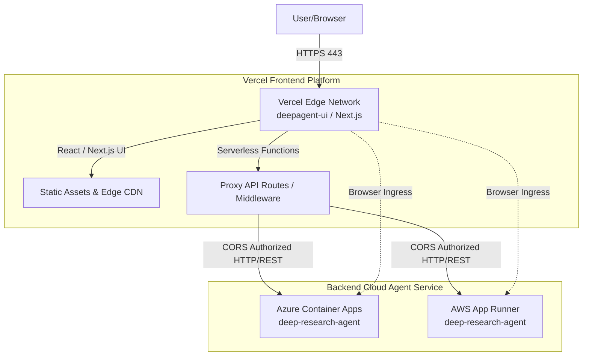

# Vercel Deployment Guide for Deep Research UI & Web Components

This guide provides step-by-step instructions for deploying the **deepagent-ui** frontend application and web components to Vercel, and connecting it securely with the backend Deep Research Agent running on Azure Container Apps or AWS App Runner.

---

## 📋 Table of Contents

- [Architecture Overview](#architecture-overview)
- [Prerequisites](#prerequisites)
- [Deployment Quick Reference](#deployment-quick-reference)
- [Deploying deepagent-ui to Vercel](#deploying-deepagent-ui-to-vercel)
  - [Option 1: Deploy via Vercel Web Dashboard (Recommended)](#option-1-deploy-via-vercel-web-dashboard-recommended)
  - [Option 2: Deploy via Vercel CLI](#option-2-deploy-via-vercel-cli)
- [Backend CORS & Connection Configuration](#backend-cors--connection-configuration)
- [Environment Variables & Secrets Reference](#environment-variables--secrets-reference)
- [Deploying Dynamic Presentation Slides (Skills)](#deploying-dynamic-presentation-slides-skills)
- [Custom Domains & HTTPS](#custom-domains--https)
- [Security Best Practices](#security-best-practices)
- [Troubleshooting](#troubleshooting)

---

## Architecture Overview

### Deployment Architecture



### Key Components

1. **deepagent-ui**: Next.js / React frontend interface hosted on Vercel Edge Network.
2. **Backend Agent Service**: Deep Research Agent running on **Azure Container Apps** (port 2024) or **AWS App Runner** (port 2024).
3. **Vercel Edge Network**: Provides automatic global CDN caching, SSL certificates, and instant deployment previews.
4. **CORS Ingress Protection**: Cross-Origin Resource Sharing rules configured in the backend Python server (`webapp/config.py`) allowing requests originating from Vercel deployment domains (e.g., `https://bmo-deepagent-ui.vercel.app` or `https://*.vercel.app`).

---

## Prerequisites

### Required Tools & Accounts

- **Node.js**: v18.0.0 or higher.
- **Vercel Account**: Sign up at [vercel.com/signup](https://vercel.com/signup).
- **Vercel CLI** (Optional for CLI deployment):
  ```bash
  npm install -g vercel
  # or invoke directly via npx
  npx vercel --version
  ```
- **Active Backend Agent URL**: Deployment URL from Azure Container Apps (`https://<app-name>.<region>.azurecontainerapps.io`) or AWS App Runner (`https://<id>.<region>.awsapprunner.com`).

---

## Deployment Quick Reference

### Deployment Methods Summary

| Method | Best For | Continuous Deployment | Command / Workflow |
|--------|----------|-----------------------|--------------------|
| **Vercel Dashboard** | Production Apps | ✅ Automatic on `git push` | Import Git repository via [Vercel Dashboard](https://vercel.com/new) |
| **Vercel CLI (Production)** | Manual / Scripted | ❌ Manual trigger | `npx vercel --prod` |
| **Vercel CLI (Preview)** | Staging / Testing | ❌ Ephemeral preview URL | `npx vercel` |

---

## Deploying deepagent-ui to Vercel

### Option 1: Deploy via Vercel Web Dashboard (Recommended)

1. **Push Code to Repository**: Ensure your latest code is pushed to your GitHub, GitLab, or Bitbucket repository.
2. **Import Project**:
   - Go to [vercel.com/new](https://vercel.com/new).
   - Select your Git repository containing `deepagent-ui` or project root.
3. **Configure Project Settings**:
   - **Framework Preset**: Next.js (or Vite / React depending on frontend choice).
   - **Root Directory**: Select `./` or `./webapp` (if frontend code resides in subfolder).
   - **Build Command**: `npm run build` or `next build`
   - **Output Directory**: `.next` (or `dist`)
4. **Set Environment Variables**:
   Add environment variables in the Vercel setup UI (see [Environment Variables & Secrets Reference](#environment-variables--secrets-reference)).
5. **Click Deploy**: Vercel will build and assign a production URL (e.g., `https://bmo-deepagent-ui.vercel.app`).

---

### Option 2: Deploy via Vercel CLI

Deploy directly from your terminal using the Vercel CLI:

```bash
# 1. Authenticate with Vercel
npx vercel login

# 2. Deploy a preview build
npx vercel

# 3. Deploy to production
npx vercel --prod
```

During the CLI wizard:
- Confirm project root directory.
- Link to existing project or create a new project (e.g., `bmo-deepagent-ui`).
- Provide target environment variable overrides when prompted.

---

## Backend CORS & Connection Configuration

For the Vercel frontend to interact with the Python agent backend without being blocked by browser security policies, ensure the backend allows the Vercel origin.

### Updating Backend CORS (`webapp/config.py`)

Verify your backend `webapp/config.py` contains the authorized Vercel origins:

```python
ALLOWED_ORIGINS = [
    "http://localhost:3000",
    "http://localhost:8000",
    "https://bmo-deepagent-ui.vercel.app",
    "https://*.vercel.app",  # Permits Vercel preview deployments
]
```

### Redeploying Backend Configuration

If updating backend CORS settings:

- **For Azure Container Apps**:
  ```bash
  ./deploy.sh --skip-build
  ```
- **For AWS App Runner**:
  ```bash
  ./deploy-aws.sh --skip-infra-setup
  ```

---

## Environment Variables & Secrets Reference

Set these environment variables in **Vercel Project Settings** $\rightarrow$ **Environment Variables**:

| Variable Name | Environment Type | Purpose / Description | Example Value (No Real Secrets) |
|---------------|------------------|-----------------------|---------------------------------|
| `NEXT_PUBLIC_AGENT_URL` | Production / Preview | Public HTTPS URL of the backend Deep Research Agent API | `https://deep-research-agent.canadacentral.azurecontainerapps.io` or `https://bh3z333bky.us-east-1.awsapprunner.com` |
| `NEXT_PUBLIC_UPLOAD_API_KEY` | Production / Preview | Auth key for uploading documents to research context | `<your-upload-api-key>` |
| `NEXT_PUBLIC_ENABLE_EVAL` | Production / Preview | Toggles evaluation metrics dashboard display | `true` |
| `NEXT_PUBLIC_SITE_TITLE` | Production / Preview | Customizable UI site branding header | `Deep Research Agent Studio` |

> [!IMPORTANT]
> Variables prefixed with `NEXT_PUBLIC_` are bundled into client-side JavaScript code. **Do not put raw backend API keys or master credentials in `NEXT_PUBLIC_` variables.**

---

## Deploying Dynamic Presentation Slides (Skills)

The project includes an interactive skill (`frontend-slides`) capable of rendering presentation slide decks built with HTML/React and deploying them instantly to live public Vercel URLs.

### Using the Slide Deployment Automation

The helper script `scripts/deploy.sh` inside the `frontend-slides` skill automates slide deployment:

```bash
# Executed by agent or developer to host generated slides
npx vercel deploy ./output/slides --yes --prod
```

Workflow executed by the tool:
1. Validates `vercel` CLI presence.
2. Checks Vercel authentication status (`npx vercel whoami`).
3. Provisions a standalone project on Vercel.
4. Returns a live shareable public preview link for stakeholders.

---

## Custom Domains & HTTPS

Vercel provides automatic SSL/TLS certificate management for all deployed domains.

### Adding a Custom Domain

1. In the Vercel Dashboard, navigate to **Project Settings** $\rightarrow$ **Domains**.
2. Enter your custom domain (e.g., `research.yourdomain.com`).
3. Add the required DNS records at your domain registrar:
   - **CNAME Record**: `cname.vercel-dns.com`
4. Vercel automatically issues an SSL certificate once DNS propagation completes.

---

## Security Best Practices

1. **Secret Isolation**:
   - Keep LLM provider keys (`AZURE_OPENAI_API_KEY`, `TAVILY_API_KEY`) strictly on the backend container environment (Azure Key Vault or AWS Secrets Manager).
   - Only expose client-safe identifiers and transient access tokens to Vercel environment variables.

2. **Cross-Origin Resource Sharing (CORS)**:
   - Avoid using wildcard `*` allowed origins in production backends.
   - Limit backend `ALLOWED_ORIGINS` specifically to your explicit Vercel production domain and preview domain pattern (`https://*.vercel.app`).

3. **Vercel Authentication**:
   - Protect staging deployment preview links using Vercel Deployment Protection or Password Protection under **Project Settings** $\rightarrow$ **Deployment Protection**.

---

## Troubleshooting

### Common Issues and Resolutions

#### 1. Cross-Origin Request Blocked (CORS Error in Browser Console)
- **Symptom**: Browser console logs `Access-Control-Allow-Origin header is missing`.
- **Cause**: Backend Python API (`webapp/config.py` / FastAPI middleware) does not list the Vercel origin.
- **Fix**: Add your Vercel URL (e.g., `https://bmo-deepagent-ui.vercel.app`) to `ALLOWED_ORIGINS` in `webapp/config.py` and redeploy the backend service.

#### 2. Network Error / Failed to Fetch Agent Endpoint
- **Symptom**: Frontend displays `Failed to connect to research agent`.
- **Cause**: `NEXT_PUBLIC_AGENT_URL` is misconfigured or pointing to an unexposed internal port.
- **Fix**: Verify `NEXT_PUBLIC_AGENT_URL` points to the external HTTPS endpoint of your Azure Container App or AWS App Runner service and that ingress is set to `external`.

#### 3. Build Fails on Vercel (`Module not found` / Command failed)
- **Symptom**: Vercel deployment log displays build failure during `npm run build`.
- **Cause**: Missing package dependency in `package.json` or incorrect Root Directory.
- **Fix**: Check build log details in Vercel Dashboard under **Deployments** $\rightarrow$ **Building**, and ensure **Root Directory** accurately points to your frontend app folder.
