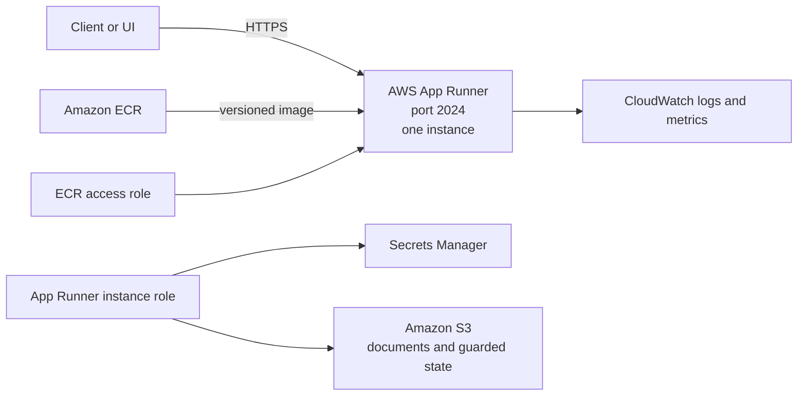

# Deploy to AWS App Runner

Use this guide to build Deep Research Agent into Amazon ECR and deploy it to AWS App Runner with Secrets Manager, IAM, CloudWatch, and S3. It is for operators with permission to create those resources and who understand the repository's singleton state model.

## Understand the architecture



`build-aws.sh` publishes `linux/amd64` images to ECR. `deploy-aws.sh` creates or updates IAM roles, a Secrets Manager mapping, S3 storage, and an App Runner service on port `2024`. It uses `/ok` for App Runner readiness and `/health` for API-version verification.

App Runner is intentionally fixed at one instance. Generic folders synchronize with S3, while `.langgraph_api` uses immutable guarded snapshots. Do not enable horizontal scaling until every local/SQLite state path is replaced with a concurrency-safe store.

## Check prerequisites

You need:

- AWS CLI v2 authenticated to the intended account and region;
- IAM permission to manage the scoped ECR repository, App Runner service, two App Runner roles, one Secrets Manager secret, and one S3 bucket;
- Apple's `container` CLI running locally, because `build-aws.sh` uses `container build`, `container image push`, and `container registry login`;
- Python 3 for version management and guarded snapshot tooling;
- provider, upload, and OAuth credentials stored outside Git.

Run non-mutating checks from repository root:

```bash
aws sts get-caller-identity
container system status
python3 --version
./deploy-aws.sh --help
./sync-files-aws.sh --help
```

Review `env-aws.sh` before deployment. Replace its sample seed, region, frontend origin, and old endpoint with target-specific values. Resource names and S3 bucket names must be unique where AWS requires it.

## Prepare configuration and secrets

Use [Configuration](../guides/configuration.md) as the canonical runtime-variable reference and [Authentication](../guides/authentication.md) for origin, OAuth, API-key, and passkey requirements.

Keep build-time configuration separate from runtime secrets. `Dockerfile-aws` does not require `.env.docker` and creates an empty `.env` in the image. However, `.dockerignore` explicitly re-includes `.env.docker`, and `Dockerfile-aws` adds the entire build context. If `.env.docker` exists, it is copied into the image at `/deps/deep_research/.env.docker`.

Therefore:

- omit `.env.docker` for the AWS build when it is not needed;
- if another current build workflow requires it, include only non-secret defaults safe to publish inside the image;
- never put OAuth client secrets, API keys, cloud credentials, storage keys, or tokens in `.env.docker`;
- inject secrets at App Runner runtime through Secrets Manager or another approved runtime secret mechanism.

> [!IMPORTANT]
> `secrets-aws.sh.example` currently requires `GOOGLE_CLIENT_ID` and `GOOGLE_CLIENT_SECRET` in `.env.docker`. Do not follow that flow: a later image build can bake those secrets into the image. The template also omits Bedrock keys consumed by `deploy-aws.sh` and includes Azure OpenAI keys that deployment does not map. This is a current security and completeness limitation of the helper.

Before deployment, create the configured Secrets Manager JSON secret through an approved secure workflow. `deploy-aws.sh` maps these exact JSON keys into App Runner runtime secrets:

- `TAVILY-API-KEY`
- `LANGCHAIN-API-KEY`
- `UPLOAD-API-KEY`
- `AWS-BEARER-TOKEN-BEDROCK`
- `AWS-BEDROCK-ENDPOINT`
- `MODEL-NAME`
- `GOOGLE-CLIENT-ID`
- `GOOGLE-CLIENT-SECRET`

Every mapped key must exist in the configured secret. When `secrets-aws.sh` is absent, `deploy-aws.sh` uses the existing Secrets Manager secret, which avoids the unsafe `.env.docker` helper path. Verify only its metadata before deployment:

```bash
source ./env-aws.sh

aws secretsmanager describe-secret \
  --secret-id "$SECRETS_MANAGER_NAME" \
  --region "$AWS_REGION" \
  --query '{name:Name,arn:ARN,updated:LastChangedDate}'
```

Never echo the JSON secret, paste real keys into commands, or include `aws secretsmanager get-secret-value` output in logs.

## Build and push the image

```bash
./build-aws.sh
```

The script verifies AWS identity, creates the ECR repository when absent, increments `API_VERSION`, writes `.build_version`, builds a no-cache `linux/amd64` image from `Dockerfile-aws`, and pushes `latest` plus the timestamped tag.

Check the immutable tag without exposing credentials:

```bash
source ./env-aws.sh
BUILD_VERSION=$(tr -d '\n' < .build_version)

aws ecr describe-images \
  --repository-name "$ECR_REPO_NAME" \
  --image-ids imageTag="$BUILD_VERSION" \
  --region "$AWS_REGION" \
  --query 'imageDetails[0].{tags:imageTags,pushed:imagePushedAt,size:imageSizeInBytes}'
```

## Deploy in read-only mode first

```bash
./deploy-aws.sh
```

The default sets `LANGGRAPH_S3_READ_ONLY=true`. It creates or reuses:

- `AppRunnerECRAccessRole-$SEED`, trusted by `build.apprunner.amazonaws.com`, with the AWS-managed ECR access policy;
- `AppRunnerInstanceRole-$SEED`, trusted by `tasks.apprunner.amazonaws.com`, with scoped Secrets Manager and S3 inline policies;
- the configured S3 bucket;
- a singleton App Runner auto-scaling configuration with minimum and maximum size `1`;
- a 2 vCPU, 4 GB App Runner service using the immutable image tag.

For an update where the roles and secret already exist and have been verified:

```bash
./deploy-aws.sh --skip-infra-setup
```

That flag skips IAM creation and secret validation; it still verifies the image, reconciles S3 access, deploys, waits for the App Runner operation, and checks readiness/version.

## Verify before enabling guarded writes

```bash
source ./env-aws.sh

curl --fail --silent --show-error "$DEEP_RESEARCH_AGENT_URL/ok"

curl --fail --silent --show-error "$DEEP_RESEARCH_AGENT_URL/health" \
  | python3 -m json.tool

SERVICE_ARN=$(aws apprunner list-services \
  --region "$AWS_REGION" \
  --query "ServiceSummaryList[?ServiceName=='$APP_NAME'].ServiceArn | [0]" \
  --output text)

aws apprunner describe-service \
  --service-arn "$SERVICE_ARN" \
  --region "$AWS_REGION" \
  --query 'Service.{status:Status,url:ServiceUrl,image:SourceConfiguration.ImageRepository.ImageIdentifier,autoscaling:AutoScalingConfigurationSummary.AutoScalingConfigurationArn}'
```

Require a 2xx `/ok`, the expected `/health` version, one instance, and expected restored threads before enabling writes. Treat `401`/`403` on protected APIs as authentication failures.

After read-only verification, enable guarded S3 snapshot publishing:

```bash
./deploy-aws.sh --skip-infra-setup --read-write
```

Do not use `--read-write` as an initial-deployment shortcut. The guarded writer uses immutable generations, fencing, stability checks, and retained snapshots, but it still depends on a singleton App Runner service.

## Synchronize S3 data

Generic `docs`, `output`, and `input` folders use `aws s3 sync` without deletion. LangGraph state uses `langgraph_snapshot` restore/publish rather than raw `.langgraph_api` copying.

```bash
# Safe default: download generic files and restore guarded state
./sync-files-aws.sh

# Explicit download, with detailed output
./sync-files-aws.sh --download --verbose

# Publish generic files and a guarded LangGraph snapshot
./sync-files-aws.sh --upload
```

The old guide incorrectly described the no-flag command as bidirectional. Upload is now explicit. Quiesce local writers before publishing `.langgraph_api`; verify source state and snapshot receipt before rollout.

The instance role currently includes `s3:GetObject`, `s3:PutObject`, `s3:DeleteObject`, and `s3:ListBucket` scoped to the configured bucket. Application safeguards and read-only mode reduce accidental state publication, but IAM itself allows writes and deletes.

## Persist authentication and compatibility data

Current `deploy-aws.sh` sets `SQLITE_DB_PATH=/deps/deep_research/deep_research.db`. That path is on the App Runner instance filesystem. It is outside the generic S3 synchronization set (`docs`, `output`, and `input`) and outside the guarded `.langgraph_api` snapshot flow. App Runner replacement, pause, or filesystem reset can therefore lose authentication accounts, sessions, passkeys, and compatibility-route data stored in this SQLite file.

Singleton scaling prevents concurrent writers; it does not make the SQLite file durable.

Before production OAuth, session, or passkey use, configure a supported durable auth backend. Current runtime adapters support PostgreSQL and Cosmos DB through `AUTH_STORE_TYPE`, but `deploy-aws.sh` provisions neither service nor its connection variables. Provision the chosen backend separately and add its connection credentials through supported App Runner runtime secret wiring. Follow [Authentication](../guides/authentication.md#choose-a-durable-session-store) for current variables and requirements.

`OAUTH_SECRET_KEY` is also absent from the runtime secret mappings generated by `deploy-aws.sh`. Supply one stable, unpredictable value through a supported App Runner runtime secret reference, or correct the deployment script's Secrets Manager mapping before enabling OAuth/passkeys. Without a stable signing key, process replacement invalidates signed OAuth state and session continuity.

## Monitor and operate App Runner

App Runner sends system and application logs to CloudWatch. In the AWS console, inspect the service's deployment/activity log before its application log when a revision cannot start.

Useful read-only commands:

```bash
aws apprunner describe-service \
  --service-arn "$SERVICE_ARN" \
  --region "$AWS_REGION"

aws apprunner list-operations \
  --service-arn "$SERVICE_ARN" \
  --region "$AWS_REGION" \
  --max-results 20 \
  --output table

aws s3api head-bucket \
  --bucket "$S3_BUCKET_NAME" \
  --region "$AWS_REGION"

aws s3 ls "s3://$S3_BUCKET_NAME/" \
  --region "$AWS_REGION"
```

Monitor CPU, memory, request count, latency, HTTP status, App Runner operations, snapshot publish/restore logs, and S3 errors. Keep singleton scaling even when request concurrency rises; reduce application concurrency or migrate state architecture before scale-out.

## Apply security controls

> [!WARNING]
> Current `deploy-aws.sh` explicitly sets `VERIFY_SSL=false`. This disables outbound certificate verification and is unsafe for production. Change the deployed value to `true` and, when a corporate CA is required, provide a supported CA bundle path such as `SSL_CAINFO`, `SSL_CERT_FILE`, `REQUESTS_CA_BUNDLE`, or `CURL_CA_BUNDLE`. Ensure the bundle exists in the image and is readable at runtime. App Runner's inbound HTTPS does not repair disabled outbound verification.

- Restrict the ECR role to image pull and the instance role to the exact Secrets Manager secret and S3 bucket.
- Keep ECR scan-on-push enabled and deploy immutable tags.
- Use Secrets Manager rotation and KMS policy appropriate to the account; create a new service operation after rotation and verify the dependent endpoint.
- Restrict `FRONTEND_URLS` to exact HTTPS origins.
- Use the stable runtime-injected OAuth signing key and durable auth store described above before enabling OAuth/passkeys.
- Keep provider and upload credentials server-side. Never expose them through browser-visible variables.
- Review S3 versioning, encryption, lifecycle, and recovery policy before write mode.
- App Runner supplies HTTPS for its service URL; keep outbound TLS verification enabled independently.

## Troubleshoot common failures

### Image build or push fails

Recheck AWS identity, ECR repository, `container` daemon, and ECR login:

```bash
aws sts get-caller-identity
container system status
aws ecr describe-repositories \
  --repository-names "$ECR_REPO_NAME" \
  --region "$AWS_REGION"
```

Then rerun `./build-aws.sh`. Do not mix `docker` and `container` commands unless the build script is intentionally changed and tested.

### App Runner create or update fails

Inspect the operation and service status:

```bash
aws apprunner list-operations \
  --service-arn "$SERVICE_ARN" \
  --region "$AWS_REGION" \
  --max-results 20 \
  --output table
```

Verify both trust policies, ECR access, exact Secrets Manager JSON keys, and instance-role access. A service must be `RUNNING` before `deploy-aws.sh` updates it.

### Readiness or version verification fails

Test both endpoints separately:

```bash
curl --show-error --include "$DEEP_RESEARCH_AGENT_URL/ok"
curl --show-error --include "$DEEP_RESEARCH_AGENT_URL/health"
```

`/ok` must return 2xx; `/health` must report the version in `webapp/config.py`. Inspect App Runner application logs for provider or startup configuration errors.

### S3 restore or publish fails

```bash
aws s3api head-bucket \
  --bucket "$S3_BUCKET_NAME" \
  --region "$AWS_REGION"

./sync-files-aws.sh --download --verbose
```

Check bucket region, local AWS identity, instance-role policy, singleton scaling, and guarded snapshot logs. Do not repair `.langgraph_api` with raw recursive upload; use `langgraph_snapshot` through the sync script.

## Related documentation

- [Configuration](../guides/configuration.md)
- [Authentication](../guides/authentication.md)
- [Reliability](../guides/reliability.md)
- [Azure deployment](azure/README.md)
- [Vercel deployment](vercel.md)
- [Handbook index](../README.md)
