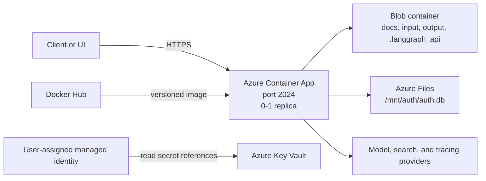

# Deploy to Azure Container Apps

Use this guide to deploy Deep Research Agent to Azure Container Apps with the repository's current scripts. It is for operators who can create Azure resources and publish container images. Review the limitations below before running anything against a subscription.

## Understand the deployed architecture

`build.sh` publishes versioned `linux/amd64` images to Docker Hub. `deploy.sh` creates or updates one externally accessible Container App on port `2024`, backed by Key Vault, a user-assigned managed identity, Azure Blob Storage, and a small Azure Files mount.



Current persistence is deliberately split:

- Blob synchronization restores application folders and LangGraph development-runtime state at startup.
- Azure Files stores the SQLite database used by authentication/session and compatibility routes.
- Cosmos DB is optional application code, but the current Azure deployment does not provision or configure it.
- `maxReplicas: 1` prevents concurrent writers to local and SQLite-backed state. Do not enable scale-out without replacing those state contracts.

See [Storage and persistence](storage.md) before migrating state or changing replica count.

## Check prerequisites

You need:

- an Azure subscription and rights to manage resource groups, Container Apps, managed identities, Key Vault access policies, and Storage;
- Azure CLI with the Container Apps extension available;
- Apple's `container` CLI running locally, because the current build script invokes `container build`, `container image push`, and `container registry login` rather than Docker;
- Python 3 for API-version management inside the build script;
- a Docker Hub account and personal access token;
- a repository-root `.env.docker` containing only non-secret defaults safe to include in a published image;
- provider and application credentials prepared from `secrets.sh.example`.

Run these non-mutating checks from repository root:

```bash
az version
az account show --output table
container system status
python3 --version
./deploy.sh --help
./sync-files.sh --help
```

Review [configuration](../../guides/configuration.md) and [authentication](../../guides/authentication.md) before exposing the service.

> [!IMPORTANT]
> `env.sh`, `build.sh`, and `deploy.sh` currently contain repository-specific defaults, including resource names, region, subscription selection, and an existing endpoint. Replace or verify them locally before running the scripts. The scripts are not a portable, parameter-only deployment template. Never commit the resulting credentials or personal deployment values.

## Prepare local deployment values

1. Review `env.sh` and choose unique Azure resource names allowed by each service.
2. Create `.env.docker`. No safe template exists in the repository; an empty file is a valid starting point:

   ```bash
   touch .env.docker
   ```

   Add only non-secret runtime defaults that are safe to publish. `build.sh` unconditionally copies this file into its build context, `.dockerignore` re-includes it, and `Dockerfile` copies it to `/deps/deep_research/.env` inside the image. Never put OAuth/API secrets, cloud credentials, storage keys, or tokens in this file.
3. Create a repository-root `.env` with `DOCKER_HUB_USERNAME` and `DOCKER_HUB_PAT`. The build script reads this ignored local file for registry login; it must not be copied into the image.
4. Copy the secret template, fill it locally, and restrict its permissions:

   ```bash
   cp secrets.sh.example secrets.sh
   chmod 600 secrets.sh
   ```

5. Ensure `secrets.sh` contains only the provider credentials needed by the selected model path. The current generated Container App configuration maps Tavily, LangChain, upload, Google, storage, and Docker Hub secrets at runtime through Key Vault references. Other model providers require corresponding safe secret references before deployment; see [configuration](../../guides/configuration.md).
6. Confirm the active Azure account and subscription:

   ```bash
   az account show --query '{name:name,id:id,tenantId:tenantId}' --output table
   ```

Do not paste subscription IDs, storage keys, or API keys into this guide or terminal history.

## Deploy in order

### 1. Populate Key Vault inputs

`deploy.sh` creates Key Vault when needed and invokes `secrets.sh` if present. Running the secret helper first is useful when the vault already exists:

```bash
./secrets.sh
```

For identity and secret-reference behavior, see [Security](security.md).

### 2. Build and publish an image

```bash
./build.sh
```

The script increments `API_VERSION`, creates `.build_version`, builds a `linux/amd64` image, and pushes both `latest` and the timestamped version to Docker Hub. Review those source changes before committing; an image build is not read-only.

### 3. Create or update Azure resources

```bash
./deploy.sh
```

The deployment reads `.build_version`; it does not build an image. It creates or reuses the resource group, Container Apps environment, Key Vault, storage account, Blob container, Azure Files auth share, and user-assigned identity. It then applies the Container App configuration and waits for `/health` to report the expected API version.

For a repeat deployment where Key Vault access-policy updates are known to be correct:

```bash
./deploy.sh --skip-kv-access
```

This flag skips only the current-user Key Vault access update. It does not skip storage, identity, application configuration, or health verification.

### 4. Synchronize runtime files when needed

```bash
./sync-files.sh --download
./sync-files.sh --upload
```

The no-flag form downloads and then uploads. Read the quiescence and overwrite warnings in [Storage and persistence](storage.md#synchronize-files-safely) before using it with `.langgraph_api`.

## Verify health

`deploy.sh` writes the resolved HTTPS endpoint back to `env.sh`. Verify the active revision and endpoint without printing secrets:

```bash
source ./env.sh

az containerapp show \
  --name "$AGENT_NAME" \
  --resource-group "$RESOURCE_GROUP" \
  --query '{state:properties.provisioningState,fqdn:properties.configuration.ingress.fqdn}' \
  --output table

az containerapp revision list \
  --name "$AGENT_NAME" \
  --resource-group "$RESOURCE_GROUP" \
  --query '[?properties.active==`true`].{name:name,state:properties.runningState,active:properties.active}' \
  --output table

curl --fail --silent --show-error "$DEEP_RESEARCH_AGENT_URL/health" \
  | python3 -m json.tool
```

Confirm the response version matches `webapp/config.py`. Treat `401` or `403` from protected endpoints as authentication failures, not storage failures.

## Move from local development

Local `langgraph dev` and Azure both listen on port `2024`, but deployment adds external ingress, managed secrets, startup Blob restore, and singleton state constraints. Before uploading local `.langgraph_api`, stop every local and Azure writer and follow [migration and rollback](storage.md#migrate-or-roll-back).

## Continue operating the deployment

- [Storage and persistence](storage.md) — Blob synchronization, Azure Files, migration, rollback, and persistence tests.
- [Operations](operations.md) — networking, monitoring, versioning, scaling limits, CI/CD, cost, and CLI references.
- [Security](security.md) — Key Vault, managed identity, authentication, network restrictions, secret rotation, and TLS.
- [Troubleshooting](troubleshooting.md) — checklist and symptom/diagnostic/repair workflows.
- [AWS deployment](../aws.md) and [Vercel deployment](../vercel.md) — alternative backend and frontend platforms.
- [Handbook index](../../README.md) — all project documentation.

Azure platform references: [Container Apps documentation](https://learn.microsoft.com/azure/container-apps/), [Azure CLI documentation](https://learn.microsoft.com/cli/azure/), and [Azure support](https://azure.microsoft.com/support/).
