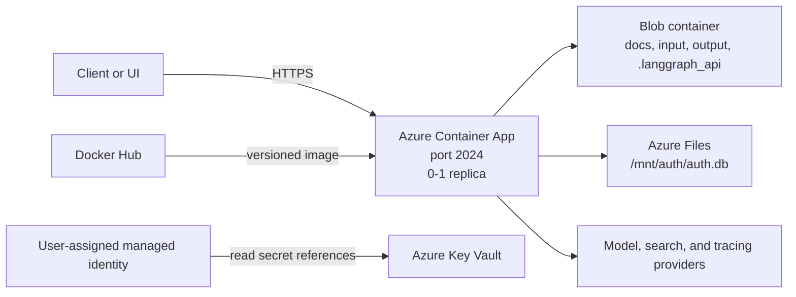

# Deploy to Azure Container Apps

Use this guide for the repository's current update-only managed passkey cutover on Azure Container Apps. It assumes bootstrap resources already exist; `deploy.sh` is not a first-deployment or disaster-recovery bootstrap script.

## Understand the deployed architecture

`build.sh` publishes versioned `linux/amd64` images to Docker Hub. `deploy.sh` updates the existing externally accessible backend Container App on port `2024`, backed by Key Vault, a user-assigned managed identity, Azure Blob Storage, and a small Azure Files mount.



Current persistence is deliberately split:

- Blob synchronization restores application folders and LangGraph development-runtime state at startup.
- Azure Files stores the SQLite database used by authentication/session and compatibility routes.
- Cosmos DB is optional application code, but the current Azure deployment does not provision or configure it.
- `maxReplicas: 1` prevents concurrent writers to local and SQLite-backed state. Do not enable scale-out without replacing those state contracts.

See [Storage and persistence](storage.md) before migrating state or changing replica count.

## Check prerequisites

Bootstrap these prerequisites separately before using this workflow:

- the resource group, Container Apps environment, and backend Container App named by `env.sh`;
- the user-assigned managed identity `${AGENT_NAME}-identity` and its assignment to the backend app;
- the Key Vault named by `KV_NAME`, with that identity granted secret `get` access;
- a pre-created, rotated `PASSKEY-PROXY-SECRET` in that Key Vault;
- all other provider and runtime secrets referenced by the existing Container App configuration;
- the existing storage account, Blob container, Azure Files share, and Container Apps environment storage binding required by the app;
- an Azure subscription with read-only access to each prerequisite and permission to update the existing backend Container App; existing resource permissions remain unchanged;
- Azure CLI with the Container Apps extension available;
- one supported local container runtime: Apple's `container` CLI on an Apple silicon Mac running a macOS release listed in [Apple's current requirements](https://github.com/apple/container#requirements), Podman, or Docker;
- Python 3 for API-version management inside the build script;
- a Docker Hub account and personal access token;
- a repository-root `.env.docker` containing only non-secret defaults safe to include in a published image;
- provider and application credentials prepared from `secrets.sh.example`.

Run these non-mutating checks from repository root:

```bash
az version
az account show --output table
command -v container || command -v podman || command -v docker
python3 --version
./deploy.sh --help
./sync-files.sh --help
```

Review [configuration](../../guides/configuration.md) and [authentication](../../guides/authentication.md) before exposing the service.

> [!IMPORTANT]
> `env.sh`, `build.sh`, and `deploy.sh` contain repository-specific names, region, and subscription selection. Verify them against already-bootstrapped resources. Historical bootstrap steps remain a separate administrator procedure; current cutover fails closed when app, identity, Key Vault access, secret, or storage prerequisite is missing. Run read-only preflight and contact the Azure administrator when access is missing. Scripts do not grant roles or access policies, create identities, or create storage resources.

## Prepare local deployment values

1. Review `env.sh` and choose unique Azure resource names allowed by each service.
2. Create `.env.docker`. No safe template exists in the repository; an empty file is a valid starting point:

   ```bash
   touch .env.docker
   ```

   Add only non-secret runtime defaults safe to publish. `build.sh` runs strict passkey dotenv check, then copies this file into build context; `Dockerfile` places it at `/deps/deep_research/.env` inside image. Never put OAuth/API secrets, cloud credentials, storage keys, tokens, `FRONTEND_URLS`, or passkey origin/RP/proxy settings in this file. If an older private file contains them, use `scripts/sanitize_passkey_dotenv.py --sanitize` through approved rotation procedure; its optional secret capture is a mode-`0600` recovery artifact and no value is printed.
3. Create a repository-root `.env` with `DOCKER_HUB_USERNAME` and `DOCKER_HUB_PAT`. The build script reads this ignored local file for registry login; it must not be copied into the image.
4. Copy the secret template, fill it locally, and restrict its permissions:

   ```bash
   cp secrets.sh.example secrets.sh
   chmod 600 secrets.sh
   ```

5. Ensure `secrets.sh` contains only the provider credentials needed by the selected model path. The current generated Container App configuration maps Tavily, LangChain, upload, Google, storage, and Docker Hub secrets at runtime through Key Vault references. Other model providers require corresponding safe secret references before deployment; see [configuration](../../guides/configuration.md).
6. Confirm the active Azure account and subscription:

   ```bash
   az account show --query '{name:name,id:id,tenantId:tenantId}' --output table
   ```

Do not paste subscription IDs, storage keys, or API keys into this guide or terminal history.

## Update in order

### 1. Resolve endpoints and confirm OAuth settings

Load canonical resource names, resolve exact Azure URLs, then update Google and GitHub provider settings shown by the resolver:

```bash
source ./env.sh
./scripts/resolve_azure_endpoints.sh
```

Resolver performs one read-only `az containerapp env show`, validates environment resource ID, `Succeeded` state, default domain, and app names, then derives both app URLs before any build. It never creates placeholder apps or queries app FQDNs. Stdout contains single-quoted assignments; deployment scripts parse exact known keys without `eval`, including resource-group names containing parentheses. `env.sh` is not rewritten.

Resolver stderr prints exact provider values:

```text
Google authorized redirect URI: https://<backend-app>.<environment-default-domain>/auth/callback/google
GitHub authorization callback URL: https://<backend-app>.<environment-default-domain>/auth/callback/github
GitHub homepage / frontend origin: https://<ui-app>.<environment-default-domain>
```

New metadata or endpoint change is blocked until provider settings are updated and process-local `OAUTH_REDIRECTS_CONFIRMED=true` is supplied. Do not persist confirmation in `.env`, `env.sh`, or another file. Recreating Container Apps environment can change `defaultDomain`; update both providers before traffic. Resolver metadata is recorded atomically in `.resolved-azure-endpoints.json` only after exact revision readiness and health verification.

Derived runtime config uses `FRONTEND_URLS` as sole multi-origin source with `PASSKEY_DERIVE_FROM_FRONTEND_URLS=true`, `PASSKEY_ENABLED=true`, and proxy ID `web-bff`. It includes Azure UI plus reserved `https://bmo-deepagent-ui.vercel.app`; backend maps each exact origin to its own hostname RP ID. Current rollout does not configure, build, deploy, or verify Vercel. Future activation requires then-current server-only proxy secret, canonical origin/proxy ID, deployment and verification before traffic; never derive canonical origin from ephemeral `VERCEL_URL`, and preserve existing credential RP continuity.

Before continuing, verify existing Key Vault inputs, including `PASSKEY-PROXY-SECRET`, and rotate/populate them through the separate approved secret-management procedure. `deploy.sh` does not create the vault, managed identity, backend app, or passkey proxy secret. For identity and secret-reference behavior, see [Security](security.md).

### 2. Build and publish an image

`build.sh` auto-detects installed runtimes in `container → podman → docker` order. Prefer `--container-cli` (or `-c`) to select one installed supported runtime for a single build. `CONTAINER_CLI` provides the cross-repository environment override, while legacy `CONTAINER_RUNTIME` remains compatible. Precedence is command option → `CONTAINER_CLI` → `CONTAINER_RUNTIME` → automatic selection; conflicting environment aliases fail unless the command option resolves the choice. Readiness depends on the selected runtime:

- Apple's runtime can start its system automatically.
- Native Linux Podman is daemonless and needs no daemon service, but `podman info` must pass.
- On macOS, Podman runs through a Podman machine. Run `podman machine init` once, then `podman machine start`, and require `podman info` to pass.
- Docker requires a running daemon and must pass `docker info`.

If the selected runtime fails its readiness check, the build stops instead of falling through to another runtime.

```bash
./build.sh
./build.sh --container-cli podman
./build.sh --container-cli=podman
./build.sh -c podman
CONTAINER_CLI=podman ./build.sh
CONTAINER_RUNTIME=podman ./build.sh
CONTAINER_RUNTIME=docker ./build.sh
```

The script increments `API_VERSION`, creates `.build_version`, builds a `linux/amd64` image, and pushes both `latest` and timestamped version to Docker Hub. Review source changes before committing; image build is not read-only. Backend must be built and deployed before Azure UI. Then run UI `./build.sh` once and UI `./deploy-azure-container-app.sh` once; UI deploy consumes its `.deployment-build.json` Docker Hub artifact and never builds. Run no Vercel deployment command for this rollout.

### 3. Update the existing backend deployment

```bash
OAUTH_REDIRECTS_CONFIRMED=true ./deploy.sh
```

The confirmation is required only when resolver metadata is new or changed; unchanged endpoints produce a nonblocking reminder. Deployment reads `.build_version`, validates existing app configuration and managed prerequisites without changing permissions, identities, storage, or secret values, applies a named Container App revision, and waits for that exact revision plus `/health` to report the expected API version.

Deployment performs read-only prerequisite checks. It does not change Key Vault
permissions, identities, storage resources, or secret values. Provision or rotate
those resources through their separately approved operator workflows.

### 4. Synchronize runtime files when needed

```bash
./sync-files.sh --download
./sync-files.sh --upload
```

The no-flag form downloads and then uploads. Read the quiescence and overwrite warnings in [Storage and persistence](storage.md#synchronize-files-safely) before using it with `.langgraph_api`.

## Verify health

`deploy.sh` does not rewrite `env.sh`. After successful revision and health checks it atomically records resolved endpoints in `.resolved-azure-endpoints.json`. Verify active revision and endpoint without printing secrets:

```bash
source ./env.sh
BACKEND_URL="$(python3 -c 'import json; print(json.load(open(".resolved-azure-endpoints.json"))["backend_url"])')"

az containerapp show \
  --name "$AGENT_NAME" \
  --resource-group "$RESOURCE_GROUP" \
  --query '{state:properties.provisioningState,fqdn:properties.configuration.ingress.fqdn}' \
  --output table

az containerapp revision list \
  --name "$AGENT_NAME" \
  --resource-group "$RESOURCE_GROUP" \
  --query '[?properties.active==`true`].{name:name,state:properties.runningState,active:properties.active}' \
  --output table

curl --fail --silent --show-error "$BACKEND_URL/health" \
  | python3 -m json.tool
```

Confirm the response version matches `webapp/config.py`. Treat `401` or `403` from protected endpoints as authentication failures, not storage failures.

## Move from local development

Local `langgraph dev` and Azure both listen on port `2024`, but deployment adds external ingress, managed secrets, startup Blob restore, and singleton state constraints. Before uploading local `.langgraph_api`, stop every local and Azure writer and follow [migration and rollback](storage.md#migrate-or-roll-back).

## Continue operating the deployment

- [Storage and persistence](storage.md) — Blob synchronization, Azure Files, migration, rollback, and persistence tests.
- [Operations](operations.md) — networking, monitoring, versioning, scaling limits, CI/CD, cost, and CLI references.
- [Security](security.md) — Key Vault, managed identity, authentication, network restrictions, secret rotation, and TLS.
- [Troubleshooting](troubleshooting.md) — checklist and symptom/diagnostic/repair workflows.
- [AWS deployment](../aws.md) and [Vercel deployment](../vercel.md) — alternative backend and frontend platforms.
- [Handbook index](../../README.md) — all project documentation.

Azure platform references: [Container Apps documentation](https://learn.microsoft.com/azure/container-apps/), [Azure CLI documentation](https://learn.microsoft.com/cli/azure/), and [Azure support](https://azure.microsoft.com/support/).
