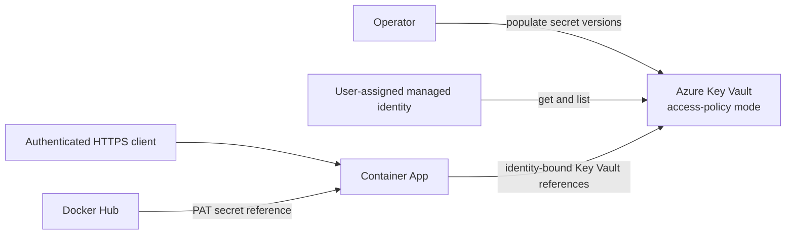

# Secure the Azure deployment

Use this guide to harden Key Vault, identity, secrets, ingress, application authentication, and TLS for Azure Container Apps. It describes current repository behavior and calls out production gaps instead of treating demo defaults as secure.

## Understand the trust path



Current `deploy.sh`:

- requires existing Key Vault and existing user-assigned managed identity already assigned to backend app;
- runs read-only preflight proving identity has secret `get` access through existing Key Vault access policy;
- configures versionless Key Vault references for application and storage secrets;
- uses the same identity reference for those Container App secrets;
- requires pre-created Docker Hub PAT and passkey proxy secrets in Key Vault and exposes them only through secret references;
- deploys external ingress and sets `VERIFY_SSL=false`.

Deployment does not grant roles or access policies, does not create identities, and does not write secret values. If read-only preflight reports missing effective access or assignment, contact Azure administrator. Older system-assigned identity and `Key Vault Secrets User` RBAC flow does not match backend UAI/access-policy prerequisite; authorization-model migration is separate approved infrastructure work.

## Populate Key Vault without exposing values

Start from the repository template:

```bash
cp secrets.sh.example secrets.sh
chmod 600 secrets.sh
```

Keep `secrets.sh`, `.env`, storage keys, Docker Hub tokens, provider keys, OAuth secrets, and exported configuration out of Git and shared logs. Prefer an approved secret-delivery system over interactive command lines. Never pass a real secret in a copied documentation command or screenshot.

`deploy.sh` expects Key Vault entries for secret references it emits, including pre-created `PASSKEY-PROXY-SECRET`; it never reads or writes values. Current generated application configuration includes Tavily, LangChain, upload, Google, storage, Blob-container, Docker Hub, and passkey proxy references. Azure OpenAI secret blocks exist only as commented source and are not injected into live YAML. If Azure OpenAI is selected, administrator must preprovision and test managed-identity or Key Vault configuration before release; see [Configuration](../../guides/configuration.md).

List metadata without reading secret values:

```bash
source ./env.sh

az keyvault secret list \
  --vault-name "$KV_NAME" \
  --query '[].{name:name,enabled:attributes.enabled,updated:attributes.updated,expires:attributes.expires}' \
  --output table
```

## Verify managed identity and secret references

```bash
IDENTITY_NAME="${AGENT_NAME}-identity"

IDENTITY_ID=$(az identity show \
  --name "$IDENTITY_NAME" \
  --resource-group "$RESOURCE_GROUP" \
  --query id --output tsv)

IDENTITY_PRINCIPAL_ID=$(az identity show \
  --name "$IDENTITY_NAME" \
  --resource-group "$RESOURCE_GROUP" \
  --query principalId --output tsv)

az keyvault show \
  --name "$KV_NAME" \
  --resource-group "$RESOURCE_GROUP" \
  --query '{rbac:properties.enableRbacAuthorization,softDelete:properties.enableSoftDelete,purgeProtection:properties.enablePurgeProtection}' \
  --output table

az keyvault show \
  --name "$KV_NAME" \
  --resource-group "$RESOURCE_GROUP" \
  --query "properties.accessPolicies[?objectId=='$IDENTITY_PRINCIPAL_ID'].permissions.secrets" \
  --output json

az containerapp show \
  --name "$AGENT_NAME" \
  --resource-group "$RESOURCE_GROUP" \
  --query '{identities:identity.userAssignedIdentities,secrets:properties.configuration.secrets[].{name:name,keyVaultUrl:keyVaultUrl,identity:identity}}'
```

Expected result: Container App includes `$IDENTITY_ID`, Key Vault access-policy mode is reported consistently, identity has `get`, and every Key Vault secret reference uses that identity. These commands are read-only preflight and expose names/resource URLs, not values; still treat exported configuration as internal operational data. Missing result requires Azure administrator action before deployment.

## Rotate secrets

1. Create a new secret version through the approved secret-delivery workflow or local `secrets.sh`; do not edit the old value in documentation or source.
2. Confirm the new version is enabled and has the intended expiry metadata:

   ```bash
   az keyvault secret list-versions \
     --vault-name "$KV_NAME" \
     --name "<secret-name>" \
     --query '[].{id:id,enabled:attributes.enabled,created:attributes.created,expires:attributes.expires}' \
     --output table
   ```

3. Create or restart a revision so Container Apps resynchronizes versionless Key Vault references.
4. Test `/health`, then the smallest authenticated endpoint that uses the rotated credential.
5. Disable the prior version only after the new revision succeeds. Retain it for the approved rollback window if policy permits.

Rotation is not guaranteed to be instantaneous. Diagnose synchronization failures in [Troubleshooting](troubleshooting.md#identity-and-secret-failures).

Enable Key Vault soft delete and purge protection according to organizational recovery policy. Purge protection is effectively irreversible during its retention period, so confirm policy before enabling it.

## Restrict network access and TLS

### Limit ingress

Current deployment is externally reachable. Require application authentication and restrict known frontend origins. For a UI deployed inside the same Container Apps environment, validate internal connectivity first and then switch the agent to internal ingress as described in [Operations](operations.md#switch-to-internal-ingress-only-with-an-in-environment-client).

VNet-integrated Container Apps environments, private endpoints, storage firewalls, and private DNS require network design at environment creation time. The retired guide's one-command subnet update is not a safe retrofit recipe. Plan address space, delegation, DNS, egress, and private endpoint access together before deployment.

For external services:

- use exact production origins, not `*`;
- do not assume a wildcard Vercel origin satisfies authentication or passkey rules;
- restrict Key Vault and Storage network access only after managed identity/data-plane access is tested from the Container Apps environment;
- keep the agent and any internal UI in the same environment when relying on internal FQDNs.

### Configure custom domains

Container Apps provides managed HTTPS for its default FQDN. For a custom domain, validate domain ownership, add the hostname, and bind an Azure-managed or uploaded certificate using the current Azure CLI workflow. Do not switch production DNS until the binding reports ready. Certificate renewal behavior depends on certificate type; monitor expiry for uploaded certificates.

### Restore outbound TLS verification

The current generated deployment sets `VERIFY_SSL=false`, which disables certificate verification for application fetchers and is unsuitable for production. Set it to `true` and provide a corporate CA bundle through the supported `SSL_CAINFO`, `SSL_CERT_FILE`, `REQUESTS_CA_BUNDLE`, or `CURL_CA_BUNDLE` path when required. The CA file must exist inside the container and remain readable after deployment.

Do not confuse application outbound verification with Container Apps inbound HTTPS; the managed endpoint can serve HTTPS while the application still skips verification for outbound calls.

## Configure application authentication

Infrastructure identity does not authenticate API callers. Before exposing external ingress:

- configure stable `UPLOAD_API_KEY` and `LANGCHAIN_API_KEY` values according to each API surface;
- use deployment-derived `FRONTEND_URLS` as sole exact frontend-origin list with `PASSKEY_DERIVE_FROM_FRONTEND_URLS=true` and explicit `PASSKEY_ENABLED=true`;
- configure OAuth callback URLs from the deployed public origin;
- use a stable `OAUTH_SECRET_KEY` for signed sessions;
- persist the auth SQLite database at `/mnt/auth/auth.db`;
- for passkeys, each exact HTTPS origin derives its own hostname RP ID; reserved `bmo-deepagent-ui.vercel.app` is full host RP ID, not public suffix `vercel.app`;
- keep one replica while SQLite is the auth store.

Current Azure script configures passkey runtime references but does not provision OAuth providers, secrets, or stable OAuth signing key. Treat them as required preprovisioned production configuration. Current rollout activates Azure only; Vercel remains reserved backend mapping until separately configured, deployed, and verified. Follow [Authentication](../../guides/authentication.md).

## Audit without leaking secrets

Send Key Vault audit logs and Container Apps logs to an approved Log Analytics workspace with controlled retention and access. Alert on denied secret reads, unusual identity activity, and repeated authentication failures.

Do not use `printenv`, `az keyvault secret show --query value`, raw Container App exports, or the protected `/storage/info` route in shared diagnostics. `/storage/info` currently returns unredacted process environment data and must not be logged, shared, exported, or screenshotted.

## Related documentation

- [Azure deployment](README.md)
- [Azure operations](operations.md)
- [Azure storage](storage.md)
- [Azure troubleshooting](troubleshooting.md)
- [Authentication](../../guides/authentication.md)
- [Configuration](../../guides/configuration.md)
