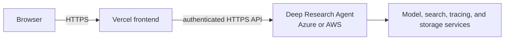

# Deploy a frontend to Vercel

Use this guide to connect a separately maintained Deep Research UI to an Azure Container Apps or AWS App Runner backend, then deploy that UI through Vercel. This repository contains the Python backend, not a Vercel frontend package or `vercel.json`; follow the selected UI repository for its exact build command and client variable names.

## Understand the architecture



Vercel hosts frontend assets and any frontend-owned serverless routes. It does not deploy this repository's LangGraph backend. The backend must have a public HTTPS endpoint for direct browser access; a Vercel deployment cannot directly reach an internal-only Azure Container App.

## Check prerequisites

You need:

- a Git repository containing the actual frontend and its package manifest;
- the Node.js version required by that frontend;
- a Vercel account with access to the frontend repository;
- Vercel CLI only if using terminal deployment;
- a healthy public Azure or AWS backend URL;
- exact frontend origin, OAuth callbacks, and passkey settings planned before production authentication is enabled.

Validate the frontend from its own repository:

```bash
node --version
npm --version
npm install
npm run build
```

Use the package's lockfile-aware install command if it differs. Do not run these commands from this backend repository expecting a Vercel application to appear.

## Prepare the backend

The backend uses `FRONTEND_URLS` as a comma-separated allowlist for frontend redirects. Add the exact production Vercel origin and any intentionally supported preview origins to deployment configuration, then redeploy the backend.

Do not edit a copied `ALLOWED_ORIGINS` snippet from the old guide. Current `webapp/config.py` reads `FRONTEND_URLS` in addition to built-in origins, and authentication imposes stricter origin rules than generic CORS.

For Azure, make the persistent change in `deploy.sh` configuration and run:

```bash
./deploy.sh
```

For AWS, set `FRONTEND_URLS` before sourcing `env-aws.sh` or update its default, then run:

```bash
./deploy-aws.sh --skip-infra-setup
```

Follow [Configuration](../guides/configuration.md) for runtime settings and [Authentication](../guides/authentication.md) for exact redirect, OAuth, cookie, and passkey requirements.

## Deploy from the Vercel dashboard

1. Push the tested frontend to GitHub, GitLab, or Bitbucket.
2. Open the [Vercel new project flow](https://vercel.com/new) and import that repository.
3. Select the directory that contains the frontend package manifest. Do not choose this backend repository unless a frontend has been deliberately added there.
4. Let Vercel detect the framework, then compare its install, build, and output settings with the frontend's own documentation.
5. Add the frontend's documented public backend URL variable with the deployed agent's HTTPS URL.
6. Add only values safe for the browser to public variables.
7. Deploy a preview, test the backend connection and authentication flow, then promote or deploy to production.

The old guide named `NEXT_PUBLIC_AGENT_URL`, `NEXT_PUBLIC_UPLOAD_API_KEY`, `NEXT_PUBLIC_ENABLE_EVAL`, and `NEXT_PUBLIC_SITE_TITLE`, but this backend repository cannot verify that a current UI consumes those names. Use the UI's source and documentation as authority.

> [!WARNING]
> Never place `UPLOAD_API_KEY`, `LANGCHAIN_API_KEY`, provider keys, OAuth client secrets, or master credentials in `NEXT_PUBLIC_*`, `VITE_*`, or any other browser-bundled variable. A public variable is visible to every visitor.

## Deploy with Vercel CLI

From the frontend project root:

```bash
# Authenticate and link the frontend project
npx vercel login
npx vercel link

# Create a preview deployment
npx vercel

# Deploy the reviewed build to production
npx vercel --prod
```

Review the project name, team, root directory, framework preset, and environment scope during linking. Use Vercel's encrypted environment settings for server-only values consumed by frontend-owned serverless code, and still avoid forwarding backend master keys to the browser.

## Verify the deployment

1. Open the Vercel deployment URL and inspect browser network requests.
2. Confirm requests target the expected HTTPS backend, not `localhost`, an internal ACA FQDN, or an old App Runner endpoint.
3. Confirm backend health independently:

   ```bash
   curl --fail --silent --show-error "https://<backend-host>/health" \
     | python3 -m json.tool
   ```

4. Exercise an authenticated request without exposing credentials in browser logs or screenshots.
5. Test OAuth redirects, signed-session continuity, logout, and passkeys when enabled.
6. Confirm the backend allowlist contains the final production origin exactly.

Preview URLs change. If previews need backend access, use a deliberate preview-origin policy and non-production credentials. Do not broaden production CORS or redirect validation to `*`.

## Deploy generated slide artifacts

This repository includes the [frontend-slides skill](../../.deepagents/skills/frontend-slides/SKILL.md) and its [Vercel deployment helper](../../.deepagents/skills/frontend-slides/scripts/deploy.sh). The skill emits self-contained presentation output; it does not change the separate UI repository ownership described above.

The helper accepts an HTML file or directory, prepares assets, and invokes Vercel with `--prod`. It deploys directly to production, so use it only after reviewing the artifact and intentionally approving production publication:

```bash
bash .deepagents/skills/frontend-slides/scripts/deploy.sh \
  /absolute/path/to/generated-slides
```

For a safer preview-first workflow, use manual Vercel commands from the reviewed artifact directory or its parent:

```bash
npx vercel deploy /absolute/path/to/generated-slides --yes
npx vercel deploy /absolute/path/to/generated-slides --yes --prod
```

Inspect generated files for embedded prompts, source documents, API keys, internal URLs, and personal data before either path. Manual preview deployment allows verification before the explicit production command; the bundled helper does not provide that preview gate.

## Configure a custom domain and HTTPS

Add the domain under Vercel project settings, apply the DNS record Vercel supplies, and wait for domain and certificate status to become ready before changing production links. Vercel manages HTTPS for attached domains, but backend origin, OAuth callback, cookie, and passkey configuration must also move to the final domain.

For passkeys, use the exact registrable RP ID. `vercel.app` is a public suffix and cannot be used as a shared RP ID; a concrete deployment host or owned custom domain is required. See [Authentication](../guides/authentication.md).

## Apply security controls

- Enable deployment protection for previews that expose internal features or test data.
- Keep production and preview environments separate.
- Use exact frontend origins and redirect URLs.
- Keep provider and backend API secrets server-side.
- Review source maps, build logs, and generated assets for accidental secret inclusion.
- Set restrictive security headers in the frontend project where its framework supports them.
- Rotate any credential immediately if it was ever placed in a browser-bundled variable.

## Troubleshoot failures

### Browser reports a CORS or redirect-origin error

**Check:** compare the browser's exact `Origin` with backend `FRONTEND_URLS`, including scheme and host. Review backend logs without printing credentials.

**Fix:** add only the intended exact origin to deployment configuration and redeploy the backend. For authentication redirects and passkeys, update the corresponding OAuth/passkey settings too; CORS alone is insufficient.

### Frontend cannot reach the agent

**Check:** open the configured backend URL directly and call `/health`. Confirm Azure ingress is external or App Runner status is `RUNNING`.

**Fix:** replace stale, internal, or `localhost` endpoints in the frontend's documented environment variable and redeploy the frontend. Do not expose an internal service merely to hide a variable-name mistake.

### Vercel build reports a missing module or command

**Check:** reproduce `npm install` and `npm run build` in the frontend repository with its supported Node version. Confirm Vercel Root Directory points to the package manifest.

**Fix:** commit the correct dependency/lockfile change in the frontend repository or correct the Vercel root/build settings. This backend repository cannot repair frontend dependencies.

### Authentication works locally but fails on Vercel

**Check:** production callback URLs, `FRONTEND_URLS`, cookie security, proxy headers, OAuth client configuration, stable `OAUTH_SECRET_KEY`, and passkey origin/RP ID.

**Fix:** align every setting to the final HTTPS origin and use a durable auth store. Follow [Authentication](../guides/authentication.md) rather than weakening origin checks.

## Related documentation

- [Configuration](../guides/configuration.md)
- [Authentication](../guides/authentication.md)
- [Azure deployment](azure/README.md)
- [AWS deployment](aws.md)
- [Upload API](../api/upload.md)
- [Handbook index](../README.md)
