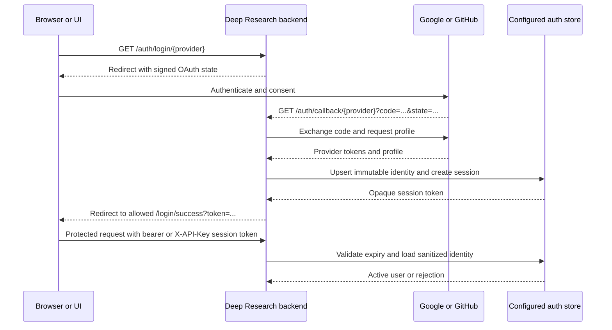

# Authenticate Deep Research services

Use this guide to secure LangGraph requests, protected custom webapp routes, browser OAuth sessions, and passkey flows. It describes current credential precedence, identity behavior, durable session stores, production controls, and recovery procedures.

## Check prerequisites

Install project dependencies with `uv sync`. Before exposing a service beyond loopback, provide stable secrets through local environment variables or a deployment secret store, configure HTTPS, and choose a durable auth store for user sessions.

## Choose an authentication mode

| Mode | Intended use | Credential accepted |
| --- | --- | --- |
| Static API key | Automation and service-to-service access | `X-API-Key`; LangGraph also accepts `Authorization: Bearer` |
| OAuth session | Browser and user-facing clients | Session token in `X-API-Key` or `Authorization: Bearer` |
| Passkey session | Identifier-free browser sign-in after enrollment | Passkey ceremony through a trusted UI BFF, then a bearer session |

API-key and OAuth-session authentication can operate together. Passkeys are disabled by default and retain OAuth as enrollment and recovery path.

## Configure API keys by service surface

### Protect custom webapp routes

Protected document upload, document management, storage, skill, and related webapp routes always authenticate. At process startup, their static key resolves in this order:

1. `UPLOAD_API_KEY`;
2. `LANGCHAIN_API_KEY`;
3. a randomly generated process-local key.

The generated fallback is logged as a warning, changes on restart, and is unsuitable for clients or multiple replicas. Set `UPLOAD_API_KEY` explicitly in production.

Use the selected static key only in `X-API-Key`:

```bash
curl http://localhost:8000/documents/list \
  -H "X-API-Key: $UPLOAD_API_KEY"
```

Protected custom routes also accept an OAuth session token in `X-API-Key` or `Authorization: Bearer`. The static API key is not accepted through `Authorization: Bearer` on this surface.

### Protect LangGraph

LangGraph resolves its static key separately:

1. `LANGCHAIN_API_KEY`;
2. `UPLOAD_API_KEY`.

It does not generate a fallback. A request may send a valid API key or OAuth session token in `x-api-key`, or in `Authorization: Bearer`; if neither static key is configured and the credential is not a valid session, authentication fails with a server-configuration error.

`ALLOW_ALL_THREADS=true` bypasses normal identity checks and returns a test identity. It is a testing switch, not an authentication mode; never enable it in a shared or production environment.

## Configure Google or GitHub OAuth

OAuth routes are served by the custom FastAPI app attached to `langgraph dev` and by the standalone Uvicorn app. When Authlib dependencies import successfully, OAuth route capability is enabled even if provider credentials are blank; configure credentials before login, because blank or invalid values fail during the OAuth flow.

### Choose provider URLs

Register browser and callback URLs before copying credentials. Replace example domains with externally visible origins; callback scheme, hostname, port, path, case, and trailing slash must match provider configuration.

| Surface | Frontend origin or homepage | Google callback | GitHub callback |
| --- | --- | --- | --- |
| Local `langgraph dev` | `http://localhost:3000` | `http://localhost:2024/auth/callback/google` | `http://localhost:2024/auth/callback/github` |
| Local standalone Uvicorn | `http://localhost:3000` | `http://localhost:8000/auth/callback/google` | `http://localhost:8000/auth/callback/github` |
| Production | `https://ui.example.com` | `https://api.example.com/auth/callback/google` | `https://api.example.com/auth/callback/github` |

Do not interchange `localhost` and `127.0.0.1`; providers treat them as different registered values. Behind a proxy, register public HTTPS callback and make proxy overwrite `X-Forwarded-Host` and `X-Forwarded-Proto` with trusted values.

### Register a Google OAuth client

Use Google's current [web-server OAuth instructions](https://developers.google.com/identity/protocols/oauth2/web-server) as provider source of truth:

1. Open [Google Cloud Console](https://console.cloud.google.com/), create or select project, then open Google Auth Platform or **APIs & Services**.
2. Configure OAuth consent screen/branding and audience. Supply app name, support email, and developer contact; for external testing, add intended test users. Request only `openid email profile` scopes used by this application.
3. Open **Clients** or **Credentials**, select **Create client**, and choose **Web application**.
4. Give client environment-specific name such as `Deep Research Local` or `Deep Research Production`.
5. Under **Authorized JavaScript origins**, add frontend origin when companion UI uses Google browser APIs, for example `http://localhost:3000` or `https://ui.example.com`. Origins contain scheme, host, and optional port but no path or wildcard.
6. Under **Authorized redirect URIs**, add exact backend callback from table, for example `http://localhost:2024/auth/callback/google`.
7. Create client and copy Client ID and Client Secret into secret store. Never commit downloaded client-secret file or generated value.

Google redirect URI must match authorization request exactly. `http://localhost:2024/auth/callback/google` and `http://127.0.0.1:2024/auth/callback/google` are different. Production callbacks use HTTPS. If consent screen remains in testing, only configured test users may be able to sign in.

Set copied values as `GOOGLE_CLIENT_ID` and `GOOGLE_CLIENT_SECRET`.

### Register a GitHub OAuth app

Follow current [GitHub OAuth app registration](https://docs.github.com/en/apps/oauth-apps/building-oauth-apps/creating-an-oauth-app):

1. Open [GitHub Developer Settings](https://github.com/settings/developers), select **OAuth Apps**, then **New OAuth App** or **Register a new application**.
2. Enter environment-specific application name such as `Deep Research Local`.
3. Set **Homepage URL** to frontend URL, for example `http://localhost:3000`.
4. Set **Authorization callback URL** to exact backend callback, for example `http://localhost:2024/auth/callback/github`.
5. Leave **Enable Device Flow** off unless separate device authorization workflow is intentionally implemented; browser login uses web application flow.
6. Select **Register application**, copy Client ID, then select **Generate a new client secret** and copy secret immediately.

GitHub OAuth app has one configured callback URL. Create separate app for local development and each production callback domain, or use repository's domain-keyed multi-client configuration below. Client secret is not personal access token. Runtime requests `user:email` so account with private primary email can be resolved through email API.

Set default app values as `GITHUB_CLIENT_ID` and `GITHUB_CLIENT_SECRET`.

For multiple frontend domains, the runtime also accepts paired comma-separated mappings:

```dotenv
GITHUB_CLIENT_IDS=domain-one.example:<client-id>,domain-two.example:<client-id>
GITHUB_CLIENT_SECRETS=domain-one.example:<client-secret>,domain-two.example:<client-secret>
```

The domain keys present in both variables select the matching OAuth client. Keep a default `GITHUB_CLIENT_ID` and `GITHUB_CLIENT_SECRET` when a fallback client is required.

### Configure backend OAuth environment

For one Google client, one GitHub client, and local frontend:

```dotenv
GOOGLE_CLIENT_ID=your-google-client-id
GOOGLE_CLIENT_SECRET=your-google-client-secret
GITHUB_CLIENT_ID=your-github-client-id
GITHUB_CLIENT_SECRET=your-github-client-secret
OAUTH_SECRET_KEY=
FRONTEND_URLS=http://localhost:3000
```

Generate independent signing value and inject at runtime rather than checking it in:

```bash
uv run python -c "import secrets; print(secrets.token_urlsafe(32))"
```

Keep `OAUTH_SECRET_KEY` stable across replicas and restarts so signed OAuth state cookie remains valid during callback. Restart server after changing provider credentials; route existence alone does not prove configuration ready.

### Follow the end-to-end OAuth flow



Provider access tokens remain server-side. Application session token is opaque credential, not provider JWT; frontend must treat it as secret. Session record uses immutable provider subject (`google:<sub>` or `github:<numeric-id>`) plus sanitized profile fields. Validation refreshes eligible near-expiry sessions, explicit logout revokes token, and configured auth store—not request-local memory—owns lifecycle.

### Allow frontend redirects

Set `FRONTEND_URLS` to a comma-separated list of exact frontend origins. `/auth/login/{provider}` accepts `redirect_url` only when it matches the configured origin allowlist, stores the selected frontend and safe return path in the signed session cookie, and constructs its callback from the request or forwarded host and protocol.

Register callback URLs that exactly match the externally visible scheme, host, port, and path. Configure the reverse proxy to overwrite untrusted forwarded headers rather than passing arbitrary client values.

### Validate the OAuth login flow

1. Start `uv run langgraph dev` for port `2024`, or standalone `uv run python -m uvicorn webapp:app --host 127.0.0.1 --port 8000`.
2. Open `/auth/login/google` or `/auth/login/github` on same backend origin used in registered callback.
3. Complete provider authorization. Backend callback creates session and redirects to `<frontend>/login/success?token=...`.
4. Frontend must capture token, remove it from browser history immediately, and prevent query strings from entering analytics, logs, or referrer data.
5. Validate token against same backend:

```bash
curl http://localhost:2024/auth/session/validate \
  -H "Authorization: Bearer $SESSION_TOKEN"
```

Successful response contains normalized `user` with `identity`, `email`, `name`, `provider`, and `avatar_url`, plus sanitized `metadata`. It excludes raw provider tokens and session token.

Use `POST /auth/session/refresh` to extend active session or `POST /auth/logout` to revoke it, supplying same bearer or `X-API-Key` session credential.

### Compare provider registration fields

| Requirement | Google | GitHub |
| --- | --- | --- |
| Consent configuration | Required; audience and test users may restrict access | No separate consent screen |
| Frontend field | Authorized JavaScript origins when browser SDK uses client | Homepage URL |
| Backend field | Authorized redirect URI | Authorization callback URL |
| Application scopes | `openid email profile` | `user:email` |
| Stable identity | `sub` | Numeric `id` |
| Private email behavior | Email and verification claims come from OpenID profile | Runtime requests email list when public email absent |

### Use OAuth sessions

Start login at `/auth/login/google` or `/auth/login/github`. After callback, the backend creates a random session token and redirects to `<frontend>/login/success?token=...`; the frontend should capture the token, remove it from browser history immediately, and prevent query strings from entering analytics, logs, or referrer data.

Sessions last 24 hours. Validation applies a sliding refresh when less than one hour remains; clients can also call `POST /auth/session/refresh`, validate through `GET /auth/session/validate`, and revoke through `POST /auth/logout`.

## Choose a durable session store

OAuth and passkey sessions use the current SQLite, PostgreSQL, or Cosmos DB auth-store adapters. The former README's in-memory and Redis example is not a supported runtime adapter.

| Backend | Selection and required configuration | Operational use |
| --- | --- | --- |
| SQLite | `AUTH_STORE_TYPE=sqlite` or `DB_TYPE=sqlite`; `SQLITE_DB_PATH` defaults to `:memory:` | Local development. Set a persistent path for durable sessions. |
| PostgreSQL | `AUTH_STORE_TYPE=postgres`; `DATABASE_URL` or `POSTGRES_URL`, otherwise host/user/database variables | Multi-replica production. Port defaults to `5432`. |
| Cosmos DB | `AUTH_STORE_TYPE=cosmosdb`; connection string or endpoint and key | Multi-replica production. Database defaults to `deep_research`. |

SQLite defaults to WAL journal mode. Azure Files/SMB deployments must use `AUTH_SQLITE_JOURNAL_MODE=DELETE`, mount the database on durable storage, and remain at one replica; the startup check can reject an in-memory path but cannot prove that a path is actually persistent.

## Configure passkeys

Set `PASSKEY_ENABLED=true` only after all prerequisites are present:

- at least one complete Google or GitHub OAuth configuration for enrollment and recovery;
- a durable auth store;
- `OAUTH_SECRET_KEY` containing 32-4096 unpredictable bytes;
- `PASSKEY_PROXY_ID` and a separately generated `PASSKEY_PROXY_SECRET` containing 32-4096 bytes;
- canonical origin derivation from `FRONTEND_URLS`, or a deliberately selected legacy explicit configuration; `PASSKEY_RP_NAME` is optional and defaults to `BMO Deep Agent`.

Startup fails closed when enabled passkey configuration is incomplete. Enabling derivation does not enable passkeys; both switches remain explicit:

```dotenv
FRONTEND_URLS=https://ui.example.com,https://bmo-deepagent-ui.vercel.app
PASSKEY_DERIVE_FROM_FRONTEND_URLS=true
PASSKEY_ENABLED=true
PASSKEY_PROXY_ID=web-bff
```

Keep `PASSKEY_PROXY_SECRET` server-side and inject it from the deployment secret manager. UI BFF and backend must use the same proxy ID and secret.

### Configure origins and relying parties

Canonical mode treats `FRONTEND_URLS` as sole multi-origin source. Each comma-separated entry must be an exact origin: scheme plus host and optional port, root path only, no credentials, query, fragment, or wildcard. Production origins require HTTPS; loopback development may use HTTP. Hostnames must be valid, and duplicate origins after lowercase/default-port/root normalization are rejected. `PASSKEY_RP_ID`, `PASSKEY_RP_IDS`, and `PASSKEY_ORIGINS` must all be absent, including empty assignments, when derivation is enabled.

Each accepted origin maps to its own normalized hostname RP ID, never a shared parent. Reserved rollout mapping is exact:

```text
("https://bmo-deepagent-ui.vercel.app", "bmo-deepagent-ui.vercel.app")
```

Unrelated RP domains require separate passkey enrollment. Reserved Vercel origin is included in backend derivation and tests only during current rollout; it is not evidence that Vercel UI is configured, built, deployed, or verified.

For local development, canonical mode is:

```dotenv
FRONTEND_URLS=http://localhost:3000
PASSKEY_DERIVE_FROM_FRONTEND_URLS=true
```

### Legacy explicit mode

When `PASSKEY_DERIVE_FROM_FRONTEND_URLS` is absent or `false`, legacy explicit mode remains available. Set `PASSKEY_ORIGINS` and exactly one of `PASSKEY_RP_IDS` or absent-only single-domain fallback `PASSKEY_RP_ID`. Explicit RP IDs are lowercase ASCII DNS names without schemes, ports, paths, wildcards, IP addresses, or public suffixes; every RP ID must map to a compatible exact origin. Never define both RP-ID variables.

The BFF must send same proxy identity and secret configured by backend. Never expose proxy secret through browser-visible variables.

### Tune passkey windows and limits

| Variable | Default | Purpose |
| --- | ---: | --- |
| `PASSKEY_CHALLENGE_TTL_SECONDS` | `300` | One-time ceremony lifetime. |
| `PASSKEY_RECENT_AUTH_SECONDS` | `600` | Recent-auth window for sensitive management actions. |
| `PASSKEY_AUTHENTICATED_RATE_LIMIT` | `20` | Authenticated-account rate limit. |
| `PASSKEY_ANONYMOUS_RATE_LIMIT` | `300` | Anonymous ceremony rate limit. |

Registration requires an OAuth-backed session and user verification. Authentication is identifier-free; management lists credentials for the signed-in immutable provider identity across configured RPs. Google and GitHub accounts are never linked merely because their email addresses match.

## Understand request identity

OAuth accounts use immutable provider subjects: `google:<sub>` or `github:<numeric-id>`. The auth store rejects provider/subject conflicts and refreshes sanitized profile data separately from identity.

LangGraph receives a compact identity containing `identity`, `display_name`, and `is_authenticated`; a static key maps to `admin`. The custom `/auth/session/validate` response exposes normalized user fields and sanitized provider metadata, while excluding raw provider tokens and the session token.

Protected custom routes currently authorize through a boolean helper; they do not populate the README's former `request.state.user_identity` example. Code requiring user metadata should validate the session through the current auth store or session endpoint rather than assuming that request-state field exists.

## Harden production deployments

- Terminate TLS before every OAuth, session, and passkey route; retain HTTPS through the trusted proxy boundary.
- Store API keys, OAuth client secrets, `OAUTH_SECRET_KEY`, and `PASSKEY_PROXY_SECRET` in a secret manager. Generate each independently and rotate with an explicit session-invalidation plan.
- Keep `OAUTH_SECRET_KEY` stable across replicas and restarts so signed OAuth state cookies remain valid.
- Session-cookie `Secure` currently follows passkey origin configuration and is false when passkeys are disabled; do not expose an HTTP route for a production auth domain.
- Use PostgreSQL or Cosmos DB for multi-replica auth state. Use persistent SQLite only for a single replica.
- Restrict `FRONTEND_URLS`, CORS origins, OAuth callbacks, and passkey origins to intended domains.
- Strip or overwrite inbound `X-Forwarded-Host` and `X-Forwarded-Proto` at the edge.
- Keep auth and session endpoints out of verbose request-body and query-string logs.
- Monitor failed logins and expired-session cleanup. General OAuth endpoints do not gain rate limiting from passkey ceremony limits.

## Recover Cosmos passkey reservations

A crashed Cosmos writer can leave a capacity reservation after the credential or challenge document was never created. Stop every application replica and auth writer before repair; Cosmos cannot fence a paused writer across containers.

Dry-run an age-bounded inspection first:

```bash
uv run python -m scripts.reclaim_cosmos_auth_reservations \
  --identity 'google:<provider-subject>' \
  --cutoff <unix-timestamp> \
  --confirm-quiesced
```

Review the count-only JSON, then repeat with `--apply`. `--limit` bounds one invocation to at most 100; the tool point-reads referenced documents and uses the current account ETag before removal. Restart writers only after it exits.

Committed markers remain untouched by default. If the underlying document is known to be absent, perform a separate dry-run with `--include-committed-missing`, then apply while all writers remain stopped; this opt-in path has no age signal.

## Troubleshoot authentication

### Login reports missing or invalid client configuration

Confirm the selected provider has both ID and secret and restart the process after changing `.env`. OAuth capability may be loaded even with blank credentials, so route availability alone does not prove provider readiness.

### Provider rejects the redirect URI

Compare scheme, hostname, port, and callback path character for character. `langgraph dev` normally serves callbacks on port `2024`; standalone Uvicorn uses the port passed to the command, commonly `8000`.

For Google, configure both frontend JavaScript origins and backend redirect URIs. For GitHub, configure Homepage URL and Authorization callback URL; private emails are read through the requested `user:email` scope.

### Protected route returns 401 after restart

If no stable `UPLOAD_API_KEY` or fallback `LANGCHAIN_API_KEY` was configured, the custom webapp generated a new process-local key. Set an explicit key and update the client.

### Sessions disappear or replicas disagree

Check `AUTH_STORE_TYPE`/`DB_TYPE` and database connectivity. An unset SQLite path is in-memory, a local SQLite file is not shared across replicas, and SQLite on SMB requires `DELETE` journal mode plus a single replica.

### Passkey startup fails

Check OAuth recovery, durable storage, secret lengths, exact origins, RP-ID exclusivity, and proxy settings. Use `uv run pytest tests/test_passkeys.py -q` and `uv run pytest tests/test_auth_store.py -q` for focused local validation.

## Related documentation

- [Configuration](configuration.md)
- [Usage](../getting-started/usage.md)
- [Document Upload API](../api/upload.md)
- [Thread Wiki API](../api/wiki.md)
- [Azure security](../deployment/azure/security.md)
- [Handbook index](../README.md)
